# 目录

[TOC]

# Autosar 框图


 


MCAL 的划分


 

autosar 分层后代码结构：


 

一个汽车里可以有几千个ecu，但绝不可能有几千个tc397，因此ecu和mcu并不是一个概念；用一路ADC+2路gpio+电磁阀+机械结构就可以构成一个座椅ECAS控制器，而这就是一个ECU；ecu在autosar的软件框架下会映射到app层中的一个swc，对这个ecu的所有操作函数整合在一个文件下就是swc_ECAS.c，而这个c文件中的api会向下通过rte调用mcal_adc.c和mcal_gpio.c中的api。


 

# [EB软件使用说明文档](https://www.cnblogs.com/lance9527/p/17009817.html)

1. EB软件目录结构：，重点关注demos， doc， plugins 和 workspace这几个文件夹。demos文件夹内包含一些配置的demo工程，你也可以把自己的工程放到这个路径下； doc文件夹内包含EB软件的所有说明，包含使用说明，文件配置和代码生成的所有操作说明，需要仔细阅读了解； plugins文件夹内放置MCAL驱动的插件形式文件；workspace文件是EB工程的临时文件夹，生成的代码会存放在这里，同时这里还包含工程文件的副本，这个文件夹内除.metadata外的文件用户是可以自由删除的，当然前提你需要知道你这么操作的意图。

 

1. 双击图标进入软件,如果提示错误则删除EB安装路径下workspace\.metadata\.plugins内的所有文件，然后重新启动软件。在界面中点击 Start 按钮进入软件主界面，如下：

 

　　　　　　区块说明：

　　　　　　1： 主菜单栏

　　　　　　2： 主快捷键栏

　　　　　　3： 工程涉及的驱动模块列表栏

　　　　　　4： 各驱动模块主工作配置区

　　　　　　5： 各驱动模块所包含的配置项（容器/container）列表栏

　　　　　　6： 告警，错误信息提示栏

　　　　　　7： 告警，错误信息详细描述栏

　　　　　　8： 不是很重要，可以自行参考原始文档

　　　　　　9： 不是很重要，可以自行参考原始文档

 

1. 新建工程，File -> New -> Configuration Projec

 

　　

 

Project name 栏中输入你的工程名称，符合命名规则即可，禁止非英文字符。

AUTOSAR Release Version 栏中下拉选择一个autosar的版本，比如 4.2.2，之后Next


ECU ID 栏中输入一个自定义的名称，规则和上一步的 Project name 相同

Target 栏中下拉选择一个自己开发板的硬件架构

按图勾选，这里表示由软件自动添加一些最小工程配置的必须文件， 之后Next

 

1. 添加驱动模块， 在上一步的 ECU ID （本例的ECU ID是 TboxConfig）上点击右键，在点击 Module Configurations... 按钮

 

 

 

左侧Available Modules框中列出了所有可用的驱动模块，未使用驱动用黑色加粗显示，使用的驱动用黑色细体显示， 以 Os（V1.0.1 AS4.2.2）为例，驱动名称叫Os， 驱动版本是1.0.1，可适配的autosar版本是4.2.2。同一个驱动会有不用的驱动版本和所兼容autosar版本，用户需要选择合适的autosar版本对应的驱动版本。而用户使用的autosar版本在第3步的AUTOSAR Release Version中选择过。

在Available Modules框中选中待用的驱动双击就会出现在框Module Configurations中， 全部选择完毕后点击Finish。

如果有不需要的模块则在框Module Configurations选中需要删除的模块，点击红框5处删除。


 

1. 主工作区配置


在工程管理窗口选择需要配置的模块展开（上图1处），展开后双击下面的实例打开（上图2处），在主工作区进行配置。

图中3处是配置类型选项，每个模块都有该选项，但不同模块的选项不同，最多三个，分别是：VariantPostBuild, VariantPreCompile, VariantLinkTime（3个选项的解释会在其他文章详细介绍）。

图中4处是容器名，很多地方都有容器名设置，该名字只要满足变量名规则即可，可按照自己意愿任意设置，通常保持默认即可。容器一词比较形象，因为容器可以用来装东西，而这里一般下面包含各种配置选项，容器名前面也是文件夹图标表示，容器名对应在代码实现通常是一个结构体或类或类似数据结构。

如果发现图中5处这种选框是灰色的（不能设置），但是前面有一个小的红色方框，这种是可选项，如需配置该选项，可点击前面小的红色方框，然后就可以配置该选项了，如图6。

各选框前后有各种图标，比如图中7，8，9，10，11处，这里只列举比较特殊的图标，还有其他各种图标，自己多细心，掌握方法，举一反三，将鼠标移到图标上面会有提示信息。这里再提示一下，任何选项用鼠标选中后，在属性描述窗口里面都有关于该配置项的详细描述。

图7处一支笔和一个计算器重叠的图标代表当前处于手动输入模式，但是该选项支持自动计算.

点击一次图7的图标后就变成图8所示的只有一个计算器图标，表示当前处于自动计算模式，只需再点一下计算器图标，软件会自动计算该选项的值并更新到前面的输入框内。

图9所示的文本图标，点击可以添加备注。

图10的图标，一个文本里面有数字123，点击可以设置数据格式。

图11的图标，一个文本加上@符号，该图标表示本选项是一个链接，需要先在其他地方配置好参考点，然后这里来引用，在其他地方配置好后这里下拉框会自动识别。点击该图标，然后选择Go to referenced node就会跳转到定义参考点的地方（需要先配置好参考点）。

图中12处有3个图标，第一个图标@符号，该功能目前版本有bug，无法设置路径，其功能和图11处解释类似。第二个图标向上的箭头，代表向上走一层，通常在容器嵌套时使用。第三个图标，一个房子，点击该图标直接回到模块主配置界面，通常也在容器嵌套设置时使用。

图中13处两个箭头用于移动容器元素，移动时需先选中元素。加号用于添加一个容器/元素。红色叉删除。红叉后面的两个文本重叠图标表示复制某个元素。后面那个小人图标非常有用，但是大部分时候这个是灰色的。有些容器对元素个数有要求，如果实际配置的元素不满足要求，这时这个小人图标会变亮，这时只需点击小人图标，会一次性自动给你建好（可能是多个），当然也可以手动一个一个点击绿色加号添加。其余图标使用较少，功能也比较简单，这里不描述了，请自行研究。

图中14处有个小的向右的箭头和数字，表示有隐藏的标签页没显示完，配置时需小心。

图中15处为AdcHwUnit容器里面添加的一个元素，但是它本身也是一个容器，可以发现15后面也是一个文件夹图标，双击该元素会进入新的窗口/配置界面进行配置。如果类似这种容器嵌套层太多，可使用上文提到的图标进行返回。嵌套如果太多会非常复杂，很容易遗漏，所以配置时需要特别注意。针对嵌套太深的问题，在左侧的模块概览窗口里面也许会帮助你很多，除了之前提到的两个返回图标，也可以在概览窗口里面直接点击想进入的配置项即可。如图中红色矩形框所示。

最后就是图中16及17处的常规配置，复选框，下拉框等。不再详述，根据需要勾选即可。

备注：


 


 

1.  代码生成，经过第4步和第5步已经添加并配置了一些驱动模块，之后在ECU ID上右键，依次点击 Verify Project 和 Generate Project ， 如果工程有错会在错误提示栏中报错，如果没错就会生成output文件夹。


EB Tresos工具里面的属性窗口不单显示各配置项的信息，同时也可以显示错误信息的描述。同样只需要在信息台窗口里面选中某个错误，然后在属性窗口里面的Description和Problems标签页中会显示详细描述，通常情况下错误描述信息比较长，可能显示不完整，可将鼠标移到相应错误信息上面停留1秒左右会弹出提示信息框（该方法可直接在信息台里面使用，不必非要到属性窗口）。

Problem View窗口里显示的错误信息通常是配置错误，比如某些选择勾选冲突，或者某个容器里面需要添加元素等。这些错误可以被工具识别，同时相应的错误提示信息比较详细，明确。双击错误可直接跳转到对应的地方。

Error Log窗口里显示的错误信息通常提示不够明确且无法通过双击自动跳转，大部分时候会提示在某个.c/.h文件里面。这种错误处理起来比上面说的错误要费解很多，但也不是没办法。首先找到错误提示信息里面的那个文件（.c/.h文件，通常位于安装目录下，每个模块以generate_xx开头的文件夹里面，这些文件格式虽然是.c/.h，但内容并不是标准的c/c++语言，而是一种模板语言）。找到对应文件后，在里面搜索错误信息提示的一些关键字，通常是因为一些配置问题导致条件无法满足。有了这些信息后，大部分错误都可以解决了。

 

除了前面讲的自己创建工程外，EB也支持导入一个工程。 File -> import... 


点击 Existing Projects into Workspace -> Next

 

点击 Browse... 在弹出的窗口中选择要导入的工程路径， Options 选项中的 Copy projects into workspace 如果被勾选了会在EB的workspace文件夹内创建一个工程的副本文件。如果是导入外部工程，建议勾选。


之后就是重复第5，6步 配置驱动模块并生成配置代码。


# 使用EB配置Mcu驱动

1. 概述
   1. MCU驱动程序负责配置SCU、GTM、CCU6、GPT12和STM外设。驱动程序提供由AUTOSAR指定的运行时服务。MCU驱动主要负责以下工作:

•时钟、复位和静态低功耗模式功能的配置，由AUTOSAR指定

•Trap功能配置

•配置BASIC驱动所需的GTM、CCU6和GPT12的全局特性

•为定时器ip的其他驱动程序提供库支持- GTM, CCU6, GPT12和STM

•模拟转换器必须配置相位同步器

•Trap管理的运行时api

 

1. 时钟树

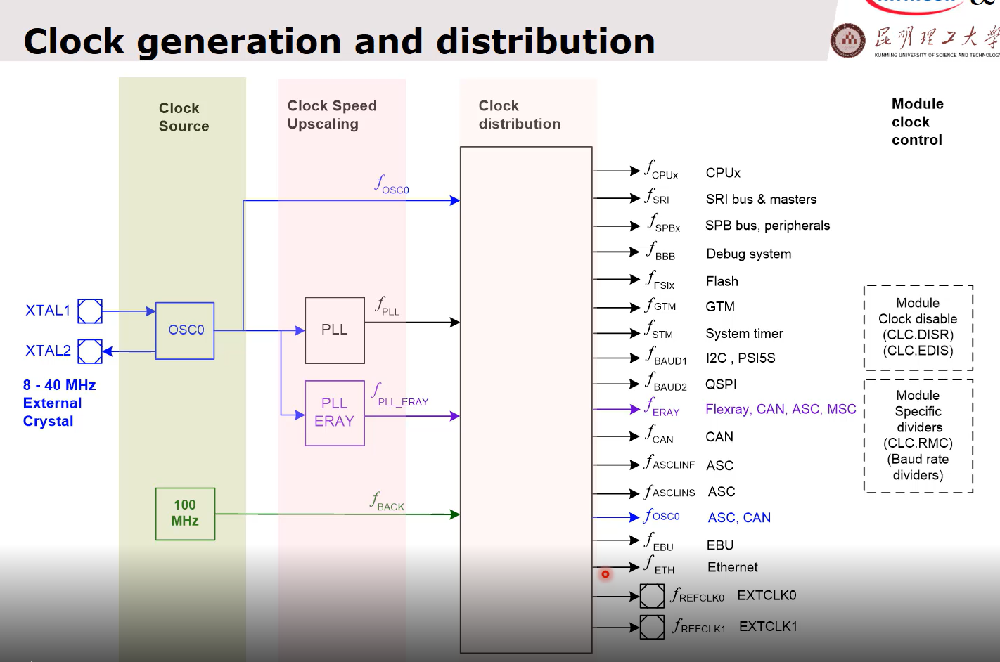

 


 

1. 配置预览

container：McuGeneralConfiguration 中包含Mcu的通用配置；

McuDevErrorDetect 是否启用开发错误诊断，本例中禁用；

McuMultiCoreErrorDetect 是否启用多核错误诊断，本例中禁用；

McuGetRamStateApi 是否启用获取Ram状态的api，默认禁用；

McuInitClock 是否在Mcu驱动中初始化时钟，默认启用；

McuNoPll 是否在Mcu驱动中设置和启用锁相环，选择false默认启用；

McuPerformResetApi 是否启用性能复位api，默认禁用；

McuVersionInfoApi 是否启用版本信息api，默认禁用；

McuClearColdResetStatusApi 是否启用清除冷复位状态api，默认禁用；

McuGpt12SleepModeEnabled 是否允许Gpt12外设进入休眠模式，默认禁用；

McuGtmSleepModeEnabled 是否允许Gtm外设进入休眠模式，默认禁用；

McuCcu60SleepModeEnabled 是否允许Ccu60外设进入休眠模式，默认禁用；

McuCcu61SleepModeEnabled 是否允许Ccu61外设进入休眠模式，默认禁用；

McuIfxLpmApi 是否启用英飞凌定义的低功耗模式api，默认禁用；

McuIfxTrapApi 是否启用英飞凌定义的trap相关api，默认禁用；

McuIfxCpuCcuconApi 是否启用CPU时钟配置寄存器更新api，默认禁用；

McuIfxDeInitApi 是否启用英飞凌定义的失能初始化api，默认禁用；

McuClockSourceFailureNotification 是否启用与时钟故障相关的dem上报，默认禁用；

McuSafetyEnable 是否启用安全模式，本例中禁用

McuInitCheckApi 是否启用初始化检查api，默认禁用；

McuOscAmpRegulationEnable 是否启用振荡器振幅调节，默认禁用；

McuOscCapacitance0Enable 是否启用负载电容CL0，默认禁用；

McuOscCapacitance1Enable 是否启用负载电容CL1，默认禁用；

McuOscCapacitance2Enable 是否启用负载电容CL2，默认禁用；

McuOscCapacitance3Enable 是否启用负载电容CL3，默认禁用；

McuMainOscillatorFrequency 用于指定外部晶体频率值，默认20MHz；

McuSysClkFrequency 用于指定输入芯片的信号频率值，默认20MHz；

McuSystemModeCpuCore 用于指定哪些核心可以触发系统模式(休眠/待机)，本例中只是用了核心0，因此此项选择CPU_SYSTEM_CORE0_SEL0；

McuIdleModeCpuCore 用于指定哪个核心可以触发Idle模式，本例中只是用了核心0，因此此项选择CPU_SYSTEM_CORE0_SEL0；

McuStandbyEntryMode 用于指定进入待机模式的输入条件，可以选择STANDBY_ENTRY_REQ_SLEEP_SEL0 或 STANDBY_ENTRY_REQ_SEL4；

McuOscillatorMode 用于指定振荡器模式，支持3种模式，选择EXT_CRYSTAL_CERAMIC_RES_MODE_SEL0表示使用外部晶体或陶瓷谐振器模式，选择EXT_INPUT_CLOCK_MODE_SEL2表示使用外部输入时钟源模式，选择OSC_DISABLED_MODE_SEL3表示振荡器被禁用；

McuInitDeInitApiMode 用于指定初始化api和失能初始化api的运行等级为SUPERVISOR；

McuRuntimeApiMode 用于指定运行时api的运行等级为SUPERVISOR；


 

container：McuModuleConfiguration 中包含一些大类模块的详细配置；

McuClockSrcFailureNotification 是否启用时钟源故障通知功能，默认禁用；

McuNumberOfMcuModes 用于指定MCU可用模式的数量，由软件自动生成，无须修改；

McuRamSectors 用于指定MCU可用的RAM扇区数量，由软件自动禁用，无须修改；

container：McuDemEventParameterRefs 用于表示诊断管理事件参数的引用，本例中未使用；

container：McuRamSectorSettingConf 用于表示Ram扇区的配置的引用，本例中未使用；

container：McuResetSetting 用于表示复位集的引用，本例中未使用；


 

container：McuResetSettingConf 中包含复位设置的配置参数；

McuESR0ResetConf 用于指定ESR0复位请求的响应，选择MCU_ESR0_APPLICATION_RESET_SEL2表示触发应用程序重置请求，选择MCU_ESR0_NO_RESET_SEL0表示不触发复位请求，选择MCU_ESR0_SYSTEM_RESET_SEL1表示系统复位请求触发；

McuESR1ResetConf 用于指定ESR1复位请求的响应，选择MCU_ESR1_APPLICATION_RESET_SEL2表示触发应用程序重置请求，选择MCU_ESR1_NO_RESET_SEL0表示不触发复位请求，选择MCU_ESR1_SYSTEM_RESET_SEL1表示系统复位请求触发；

McuSWResetConf 用于指定软件复位请求的响应，选择MCU_SW_APPLICATION_RESET_SEL2表示触发应用程序重置请求，选择MCU_SW_NO_RESET_SEL0表示不触发复位请求，选择MCU_SW_SYSTEM_RESET_SEL1表示触发系统复位请求；

McuSMUResetConf 用于指定SMU复位请求的响应，选择MCU_SMU_APPLICATION_RESET_SEL2表示触发应用程序重置请求，选择MCU_SMU_NO_RESET_SEL0表示不触发复位请求，选择MCU_SMU_SYSTEM_RESET_SEL1表示系统复位请求触发；

McuSTM0ResetConf 用于指定STM0复位请求的响应，选择MCU_STM0_APPLICATION_RESET_SEL2表示触发应用程序重置请求，选择MCU_STM0_NO_RESET_SEL0表示不触发复位请求，选择MCU_STM0_SYSTEM_RESET_SEL1表示系统复位请求触发；

McuSTM1ResetConf 同理如上；

McuSTM2ResetConf 同理如上；

McuSTM3ResetConf 同理如上；

McuSTM4ResetConf 同理如上；

McuSTM5ResetConf 同理如上；

McuSTM0ResetOnApplResetEnable 用于指定当应用程序请求重置时，启用重置STM0的值，选择TRUE表示触发应用程序复位时，STM0复位；选择FALSE表示触发应用程序复位时，STM0不复位；

McuSTM1ResetOnApplResetEnable 同理如上；

McuSTM2ResetOnApplResetEnable 同理如上；

McuSTM3ResetOnApplResetEnable 同理如上；

McuSTM4ResetOnApplResetEnable 同理如上；

McuSTM5ResetOnApplResetEnable 同理如上；


 

container：McuTrapSettingConf

McuCPU0ESR0TrapEnable 是否开启ESR0源对CPU0的trap请求，默认禁用；

McuCPU1ESR0TrapEnable 同理如上；

McuCPU2ESR0TrapEnable 同理如上；

McuCPU3ESR0TrapEnable 同理如上；

McuCPU4ESR0TrapEnable 同理如上；

McuCPU5ESR0TrapEnable 同理如上；

McuCPU0ESR1TrapEnable 是否开启ESR1源对CPU0的trap请求，默认禁用；

McuCPU1ESR1TrapEnable 同理如上；

McuCPU2ESR1TrapEnable 同理如上；

McuCPU3ESR1TrapEnable 同理如上；

McuCPU4ESR1TrapEnable 同理如上；

McuCPU5ESR1TrapEnable 同理如上；

McuCPU0Trap2Enable 是否开启TRAP2源对CPU0的trap请求，默认禁用；

McuCPU1Trap2Enable 同理如上；

McuCPU2Trap2Enable 同理如上；

McuCPU3Trap2Enable 同理如上；

McuCPU4Trap2Enable 同理如上；

McuCPU5Trap2Enable 同理如上；

McuCPU0SMUTrapEnable 是否开启SMU源对CPU0的trap请求，默认禁用；

McuCPU1SMUTrapEnable 同理如上

McuCPU2SMUTrapEnable 同理如上

McuCPU3SMUTrapEnable 同理如上

McuCPU4SMUTrapEnable 同理如上

McuCPU5SMUTrapEnable 同理如上

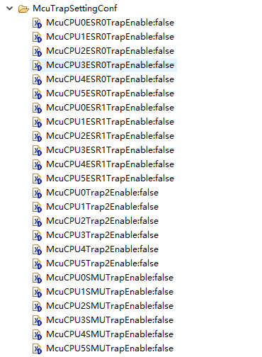

 

container：McuEruGlobalConf 中包含ERU的输入过滤器配置参数；

McuEruInputFilterRegVal 是否启用毛刺过滤器以及毛刺过滤器预分割器和过滤器深度，为0表示禁用；


 

container：McuClockSettingConfig 中包含MCU时钟设置的配置；

McuClockSettingId 用于指定设置的cpu核心号，本例中只用了cpu0；

container：McuClockReferencePoint 中包含定义的MCU时钟树参考点；

McuClockRefSelection 用于选择时钟引用源，选择MCU_USER_DEFINED_FREQUENCY表示用户自定义的频率；

McuClockReferencePointFrequency 用于定义McuClockReferencePoint容器的特定实例的频率；

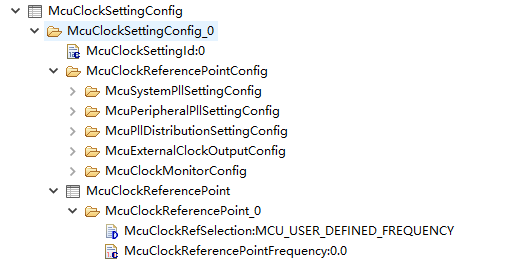

 

container：McuSystemPllSettingConfig 中包含系统锁相环时钟设置的配置参数；

McuPllInputSrcSelection 用于为两个锁相环选择输入时钟源，选择BACKUP_CLOCK_SRC_SELECT_SEL0表示选择备份时钟作为系统和外围锁相环的输入源，选择OSC_CLOCK_SRC_SELECT_SEL1表示振荡器时钟被选择为系统和外围锁相环的输入源，选择

SYSCLK_SRC_SELECT_SEL2表示选择syclk引脚作为系统和外围锁相环的输入源；

McuSystemPllPDivider 用于设置系统锁相环时钟P分压器值；

McuSystemPllNDivider 用于设置系统锁相环时钟N分压器值；

McuSystemPllK2Divider 用于设置系统锁相环时钟K2分压器值；

McuSysPllK2DivStepUpChangeDelay 用于设置系统锁相环时钟K2分压器值连续两次变化之间的步进变化所需的延迟，单位us；

McuSysPllK2DivStepDownChangeDelay 用于设置系统锁相环时钟K2分压器值连续两次变化之间的步进变化所需的延迟，单位us；

McuFmPllEnable 是否启用锁相环调频，默认禁用；

McuFMPllModAmp 用于指定锁相环调频时调制幅度的百分比值，使用默认值1.25即可；

McuClockReferencePointFrequency0 用于指定用户经过配置后最终的目标频率值，本例中为300MHz；


 

container：McuPeripheralPllSettingConfig 中包含外设锁相环时钟设置的配置参数；

McuPeripheralPllPDivider 用于设置外设锁相环时钟P分压器值；

McuPeripheralPllNDivider 用于设置外设锁相环时钟N分压器值；

McuPeripheralPllK2Divider 用于设置外设锁相环时钟K2分压器值；

McuPerPllK2DivStepUpChangeDelay 用于设置外设锁相环时钟K2分压器值连续两次变化之间的步进变化所需的延迟，单位us；

McuPerPllK2DivStepDownChangeDelay 用于设置外设锁相环时钟K2分压器值连续两次变化之间的步进变化所需的延迟，单位us；

McuPeripheralPllK3Divider 用于设置外设锁相环时钟K3分压器值；

McuPerPllK3DivStepUpChangeDelay 用于设置外设锁相环时钟K3分压器值连续两次变化之间的步进变化所需的延迟，单位us；

McuPerPllK3DivStepDownChangeDelay 用于设置外设锁相环时钟K3分压器值连续两次变化之间的步进变化所需的延迟，单位us；

McuFreqSource1ClockDivSelect 用于指定Fpll1是被因子2除还是绕过除法器，选择DIV_FACTOR_2_NOT_BYPASSED_SEL0表示2分频，选择DIV_FACTOR_2_BYPASSED_SEL1表示绕过除法器；

McuPll2DivSelect 用于指定在绕过K3除法器之前是否存在除法器因子，选择MCU_K3_DIV_FACTOR_NOT_BYPASSED_SEL0表示没绕过，选择MCU_K3_DIV_FACTOR_BYPASSED_SEL1表示绕过；

McuClockReferencePointFrequency1 用于指定经过分频器后最终输出的目标频率；

McuClockReferencePointFrequency2 用于指定经过分频器后最终输出的目标频率；


 

container：McuPllDistributionSettingConfig 中包含锁相环分布的配置参数以及时钟树中各个硬件模块的频率；

McuClockDistributionInpClockSel 用于指定时钟分配单元的输入时钟源，选择BACKUP_INPUT_CLOCK_SRC_SELECT_SEL0表示备份时钟作为输入时钟源，选择PLL_INPUT_CLOCK_SRC_SELECT_SEL1表示PLL作为输入时钟源；

McuLowPowerDivValue 是否启用低功率分压器特性，选择LOW_POWER_DIVIDER_DISABLE_SEL0表示禁用低功耗模式，选择

LOW_POWER_DIVIDE_BY_120_SEL3表示低功率模式时钟分压器设置为120，选择LOW_POWER_DIVIDE_BY_240_SEL4表示低功率模式时钟分压器设置为240，选择LOW_POWER_DIVIDE_BY_30_SEL1表示低功率模式时钟分压器设置为30，选择LOW_POWER_DIVIDE_BY_60_SEL2表示低功率模式时钟分压器设置为60；

McuSRIFrequency 用于指定SRI的主频值；

McuCPU0Frequency 用于指定CPU0的主频值；

McuCPU1Frequency 用于指定CPU1的主频值；

McuCPU2Frequency 用于指定CPU2的主频值；

McuCPU3Frequency 用于指定CPU3的主频值；

McuCPU4Frequency 用于指定CPU4的主频值；

McuCPU5Frequency 用于指定CPU5的主频值；

McuSPBFrequency 用于指定SPB的主频值；

McuFSIFrequency 用于指定FSI的主频值；

McuFSI2Frequency 用于指定FSI2的主频值；

McuReferenceFrequency1 用于指定参考时钟1的主频值；

McuReferenceFrequency2 用于指定参考时钟2的主频值；

McuBBBFrequency 用于指定BBB的主频值；

McuErayClkEnable 是否启用为ERAY模块提供频率，默认禁用；

McuErayFrequency 用于指定Eray的主频值；

McuGTMFrequency 用于指定GTM的主频值；

McuSTMFrequency 用于指定STM的主频值；

McuMscClockSourceSelection 用于指定Msc的时钟源，选择MSC_CLOCK_SOURCE_DISABLED_SEL0表示关闭MSC频率，选择

MSC_CLOCK_SOURCE_SOURCE1_SEL1表示                      McuClockReferencePointFrequency1被用作MSC分压器的输入时钟    源，选择MSC_CLOCK_SOURCE_SOURCE2_SEL2表示                McuClockReferencePointFrequency2 用作MSC分压器的输入时钟源；

McuMscFrequency 用于指定Msc的主频值；

McuMCanClockSourceSelection 用于指定MCAN外设的输入时钟源，选择MCAN_CLOCK_SOURCE_DISABLED_SEL0表示禁用MCAN频率，选择MCAN_CLOCK_SOURCE_MCANI_SEL1表示McuMCanFrequency作为MCAN外设的输入时钟源，选择MCAN_CLOCK_SOURCE_OSC_SEL2表示McuMainOscillatorFrequency作为MCAN外设的输入时钟源；

McuMCanFrequency 用于指定MCan的主频值；

McuAscLinFastFrequency 用于指定AscLin快速模式的主频值；

McuAscLinSlowClockSourceSelection 用于指定AscLin外设慢频的输入时钟源，选择ASCLINS_CLOCK_SOURCE_ASCLINSI_SEL1表示McuAscLinSlowFrequency作为asclin的输入时钟源，选择ASCLINS_CLOCK_SOURCE_DISABLED_SEL0表示关闭asclins外设频率，选择ASCLINS_CLOCK_SOURCE_OSC0_SEL2表示McuMainOscillatorFrequency被用作asclin的输入时钟源；

McuAscLinSlowFrequency 用于指定AscLin慢速模式的主频值；

McuQspiClockSourceSelection 用于指定Qspi外设的输入时钟源，选择QSPI_CLOCK_SOURCE_DISABLED_SEL0表示关闭QSPI外围频率，选择QSPI_CLOCK_SOURCE_SOURCE1_SEL1表示McuClockReferencePointFrequency1被用作QSPI分压器的输入时钟源，选择QSPI_CLOCK_SOURCE_SOURCE2_SEL2表示McuClockReferencePointFrequency2被用作QSPI分压器的输入时钟源；

McuQspiFrequency 用于指定Qspi的主频值；

McuAdcFrequency 用于指定Adc的主频值；

McuConvCtrlPhaseSynchConf 用于指定转换器控制块的相移分频器，选择PHASE_SYNCH_CONST_ACTIVE_SEL0表示固定相位信号激活，更多信息请参阅文档；

McuI2CFrequency 用于指定I2C的主频值；

McuEbuClkEnable 用于指定是否为Ebu模块提供频率；

McuEbuFrequency 用于指定Ebu的主频值；

McuHsctFrequency 用于指定Hsct的主频值；

McuHspdmClkEnable 用于指定是否为Hspdm模块提供频率；

McuHspdm160Frequencye 用于指定Hspdm160的主频值；

McuHspdm320Frequencye 用于指定Hspdm320的主频值；

McuAdasFrequency 用于指定Adas主频值；

McuGEthFrequency 用于指定GEth的主频值；

McuMcanHFrequency 用于指定Mcan的主频值；


 

container：McuExternalClockOutputConfig 中包含MCU外部时钟的配置参数；

McuExtClock0Enable 是否启用EXTCLK0信号，默认禁用；

McuExtClockOutSel0 用于指定EXTCLK0输出时钟源；

McuExtClock1Enable 是否启用EXTCLK1信号，默认禁用；

McuExtClock1Inverted 是否启用EXTCLK1反转信号，默认禁用；

McuExtClockOutSel1 用于指定EXTCLK1输出时钟源；

McuFoutClockDiv 用于指定Fout时钟的分割系数，默认1；


 

container：McuClockMonitorConfig 中包含监控时钟的配置参数；

McuPll0ClockMonEnable 是否启用Pll0时钟监控，默认禁用；

McuPll1ClockMonEnable 是否启用Pll1时钟监控，默认禁用；

McuPll2ClockMonEnable 是否启用Pll2时钟监控，默认禁用；

McuSpbClockMonEnable 是否启用Spb时钟监控，默认禁用；

McuBackupClockMonEnable 是否启用备份时钟监控，默认禁用；

McuBackupClockRangeMonEnable 是否启用备份时钟范围监控，默认禁用；


 

container：McuModeSettingConf 中包含MCU模式设置的配置参数；

McuMode 用于指定除RUN模式外所支持的模式，包括0 - IDLE mode，1 - SLEEP mode，2 - STANDBY mode；

McuEvrcLPMOnSleepReqEnable 是否启用EVRC低功耗模式，默认禁用；

container：McuStdbyModeSettingConf 中包含MCU待机模式设置的配置参数；

McuStdbyModePortTriStateEnable 用于指定pin脚在待机模式下是否处于三态，默认禁用；

McuStdbyModeESR0TriStateEnable 用于指定ESR0在备用模式下是否处于三态，默认禁用；

McuStdbyModeWakeupFromPORST 用于指定是否通过PORST启用从备用模式的唤醒，默认启用；

McuStdbyModePORSTFilterEnable 是否启用PORST数字滤波器，默认禁用；

McuStdbyModeWakeupFromEVR 用于指定是否通过唤醒定时器使能从备用模式唤醒，默认禁用；

McuStdbyModeWakeupFromSCR 用于指定是否启用通过控制器从备模式唤醒，默认禁用；

McuStdbyModeClkSelection 用于指定待机模式操作期间的主振荡器时钟，选择OSC_CLOCK_100KHZ_ONLY_SEL0表示根据SCR的请求启用或禁用100 MHz时钟，选择OSC_CLOCK_100KHZ_100MHZ_SEL1表示100 MHz时钟总是可用的；

McuStdbyModeBlankingFilterDelay 用于指定消隐过滤器的延迟；


McuStdbyModeRamEnable 用于指定在待机模式下运行时保持上电的LMU块；


container：McuStdbyModeESR0Conf 中包含备用模式下ESR0的配置参数；

McuStdbyModeESR0WakeupEnable 用于指定是否通过ESR0启用从备用模式唤醒，默认禁用；

McuStdbyModeESR0FltEnable 用于指定是否启用数字滤波器以使ESR0从备用模式唤醒，默认禁用；

McuStdbyModeESR0EdgeDetection 用于指定在上升沿检测、下降沿检测或两者同时生成触发器，选择ESR0_TRIG_FALLING_EDGE_SEL2表示下降沿检测时产生一个触发器，选择ESR0_TRIG_RISING_EDGE_SEL1表示上升沿检测产生触发器，选择ESR0_TRIG_RISING_FALLING_EDGE_SEL3表示上升沿检测和下降沿检测都生成一个触发器；

container：McuStdbyModeESR1Conf 中包含备用模式下ESR1的配置参数，配置同理同上；

container：McuStdbyModePinAConf 中包含备用PinA模式的配置参数；

McuStdbyModePinAWakeupEnable 用于指定是否通过PinA启用备用唤醒功能，默认禁用；

McuStdbyModePinAFltEnable 用于指定是否启用数字滤波器使PinA从待机模式唤醒，默认禁用；

McuStdbyModePinAEdgeDetection 用于指定在上升沿检测、下降沿检测或两者同时发生时是否生成触发器，选择PINA_TRIG_FALLING_EDGE_SEL2表示在下降沿检测时产生一个触发器，选择PINA_TRIG_RISING_EDGE_SEL1表示上升沿检测产生触发器，选择PINA_TRIG_RISING_FALLING_EDGE_SEL3表示上升沿检测和下降沿检测都生成一个触发器；

container：McuStdbyModePinBConf 中包含备用PinB模式的配置参数，配置同理同上；

container：McuStdbyModeWakeupTimerConf 中包含备用唤醒计时器的配置参数；

McuStdbyModeWakeupTimerEnable 是否支持通过唤醒定时器的方式从备用模式中唤醒，默认禁用；

McuStdbyModeWakeupTimerValue 用于指定唤醒计时器重新加载值；

McuStdbyModeWakeupTimerClkDiv 用于指定唤醒定时器时钟源的选择，选择WUT_100KHZ_DIV_CLK_SEL1表示唤醒定时器运行在100 kHz频率除以1024分频值，选择WUT_100KHZ_NO_DIV_CLK_SEL0表示唤醒定时器在100 kHz频率上运行；

McuStdbyModeWakeupTimerMode 用于指定唤醒定时器模式，选择WUT_AUTO_RELOAD_MODE_SEL0表示计数器从McuStdbyModeWakeupTimerValue开始，在计数器下溢时，将重新加载唤醒计数器值McuStdbyModeWakeupTimerValue，选择WUT_AUTO_STOP_MODE_SEL1表示计数器从McuStdbyModeWakeupTimerValue开始，在计数器下溢时，唤醒计时器停止；


 

container：McuGpt12PrescalerConf 中包含GPT预计算的配置参数；


Gpt1BlockPrescalerSel 用于指定GPT1块预计算的选择；


Gpt2BlockPrescalerSel 用于指定GPT2块预计算的选择；


 

container：GtmGlobalConfiguration 中包含GTM硬件的全局配置参数；

sub-container：McuGtmClockManagementConf 中包含处理CMU参数的配置；

sub-container：GtmClusterConf 中包含集群配置；

sub-container：GtmTbuChannelConf 中包含GTM的TBU通道的配置参数，TBU可用于TOM或ATOM触发器和TIM通道；

sub-container：GtmTomGlobalConf 中包含TOM全局参数的配置参数；

sub-container：GtmAtomGlobalConf 中包含ATOM全局参数的配置参数；

sub-container：GtmTriggerForAdc 中包含GTM计时器和ADC触发线之间的绑定；

sub-container：GtmTriggerForDsadc 中包含GTM计时器和DSADC触发线之间的绑定；


 

container：McuGtmClockManagementConf 中包含处理CMU参数的配置；

GtmCmuGlobalClockNumerator 用于配置可配置时钟和固定时钟的全局分子值；GtmCmuGlobalClockNumerator 应不小于 GtmCmuGlobalClockDenominator；

GtmCmuGlobalClockDenominator 用于配置可配置时钟和固定时钟的全局分母值；

GtmCmuFixedClockEnable 是否启用固定时钟，固定时钟的源由GtmCmuFixedClockSel定义；默认启用；

GtmCmuFixedClockSel 用于指定固定时钟的源；


GtmCmuConfigClock0Enable 是否启用可配置的clock0；默认启用；

GtmCmuConfigClock0Div 用于指定可配置的clock0分割线计数值，默认0；

GtmCmuConfigClock1Enable 是否启用可配置的clock1；默认启用；

GtmCmuConfigClock1Div用于指定可配置的clock1分割线计数值，默认0；

GtmCmuConfigClock2Enable 是否启用可配置的clock2；默认启用；

GtmCmuConfigClock2Div用于指定可配置的clock2分割线计数值，默认0；

GtmCmuConfigClock3Enable 是否启用可配置的clock3；默认启用；

GtmCmuConfigClock3Div用于指定可配置的clock3分割线计数值，默认0；

GtmCmuConfigClock4Enable 是否启用可配置的clock4；默认启用；

GtmCmuConfigClock4Div用于指定可配置的clock4分割线计数值，默认0；

GtmCmuConfigClock5Enable 是否启用可配置的clock5；默认启用；

GtmCmuConfigClock5Div用于指定可配置的clock5分割线计数值，默认0；

GtmCmuConfigClock6Enable 是否启用可配置的clock6；默认启用；

GtmCmuConfigClock6Div用于指定可配置的clock6分割线计数值，默认0；

GtmCmuConfigClock7Enable 是否启用可配置的clock7；默认启用；

GtmCmuConfigClock7Div用于指定可配置的clock7分割线计数值，默认0；

GtmCmuExtClock0Enable 是否启用外部clock0；默认禁用；

GtmCmuExtClock0Numerator 用于指定外部时钟0的分子值，默认1；

GtmCmuExtClock0Denominator 用于指定外部时钟0的分母值，默认1；

GtmCmuExtClock1Enable 是否启用外部clock1；默认禁用；

GtmCmuExtClock1Numerator 用于指定外部时钟1的分子值，默认1；

GtmCmuExtClock1Denominator 用于指定外部时钟1的分母值，默认1；

GtmCmuExtClock2Enable 是否启用外部clock2；默认禁用；

GtmCmuExtClock2Numerator 用于指定外部时钟2的分子值，默认1；

GtmCmuExtClock2Denominator 用于指定外部时钟2的分母值，默认1；


 

container：GtmClusterConf 中包含集群配置，集群是指被组织为一组GTM子外围设备实例；

GtmCmuClusterInputClockDividerEnable 是否启用GTM到CMU的划分，选择CLS_CLK_CFG_DISABLED_SEL0表示集群x被禁用，选择CLS_CLK_CFG_ENABLED_WITHOUT_DIV_SEL1表示在没有时钟分配器的情况下启用集群x，选择CLS_CLK_CFG_ENABLED_WITH_DIV_SEL2表示集群x启用了时钟分配器；

GtmClusterConfClock0Src 用于指定可配置的时钟0为当前GTM集群子外设指定输入时钟源，选择CMU_CONF_CLOCK0_SEL0表示使用时钟0，选择CMU_CONF_CLOCK8_SEL1表示使用clock8，选择EXT_CAPTURE_SEL2表示使用外部捕获源；

GtmClusterConfClock1Src 同理同上；

GtmClusterConfClock2Src 同理同上；

GtmClusterConfClock3Src 同理同上；

GtmClusterConfClock4Src 同理同上；

GtmClusterConfClock5Src 同理同上；

GtmClusterConfClock6Src 同理同上；

GtmClusterConfClock7Src 同理同上；

GtmClusterFixedClockSrc 用于指定GTM集群x子外设的输入时钟源，选择CMU_CONF_CLOCK8_SEL1表示可配置的clock8将用于时钟，选择CMU_FIXED_CLOCK0_SEL0表示固定的clock0将用于clock；

sub-container：GtmClusterConf_n 同理同上；


 

container：GtmTbuChannelConf 中包含Tbu通道的配置参数；

GtmTbuChannelEnable 是否启用TBU通道，默认禁用；

GtmTbuChClockSourceSelection 为相应的TBU通道选择可配置的时钟源，该参数只与TBU通道0、1和2相关，可选值如下；


GtmTbuChResolutionSel 用于指定TBU_CH0_BASE给出的时基值的分辨率，选择TBU_CH_LOWER_COUNT_BITS_SEL0表示使用TBU_CH0_BASE的0到23位，选择TBU_CH_UPPER_COUNT_BITS_SEL1表示TBU_CH0_BASE的3到26位；

GtmTbuChMode 用于指定定时器计数模式，选择FORWARD_BACKWARD_SEL1表示正向/反向计数器模式，选择FREE_RUNNING_COUNTER_SEL0表示空闲运行计数器模式；

GtmTbuChModuloCntrSel 选择模计数器的信道选择器，这仅适用于TBU通道3，选择TBU_CH1_SEL0表示使用的TBU_CH1值，选择TBU_CH2_SEL1表示使用的TBU_CH2值；

sub-container：GtmTbuChannelConf_n 同理同上；


 

container：GtmTomGlobalConf 中包含TOM全局参数的配置参数；

GtmTomActionTimeBaseSelection 用于指定要与GtmTomActionTimeBaseValue中配置的值进行比较的选定时基，选择TOM_ACT_TB_TBU_TS0表示当GtmTomActionTimeBaseValue与TBU_TS0匹配时，生成TOM组级触发器，选择TOM_ACT_TB_TBU_TS1表示当GtmTomActionTimeBaseValue与TBU_TS1匹配时，生成TOM组级触发器，选择TOM_ACT_TB_TBU_TS2表示当GtmTomActionTimeBaseValue与TBU_TS2匹配时，生成TOM组级触发器；

GtmTomActionTimeBaseValue 用于为TOM组通道级别触发器指定基本时间值；

GtmTomChResetCn0OnTriggerEnable 是否启用TOM通道计数器CN0值，该值将在来自任何触发器源的全局触发器上重置；

GtmTomChInternalTriggerEnable 是否启用相应组通道号的通道0的内部触发器，默认禁用；

GtmTimerPortPinSelect 用于指定定时器所连接的端口引脚；

sub-container：GtmTomChannelConf_n 同理同上；

sub-container：GtmTomGlobalConf_n 同理同上；


 

container：GtmAtomGlobalConf 中包含ATOM全局参数的配置参数；

GtmAtomActionTimeBaseSelection 用于指定要与GtmAtomActionTimeBaseValue中配置的值进行比较的选定时基，选择ATOM_ACT_TB_TBU_TS0表示当GtmAtomActionTimeBaseValue与TBU_TS0匹配时，生成ATOM组级触发器，选择ATOM_ACT_TB_TBU_TS1表示当GtmAtomActionTimeBaseValue与TBU_TS1匹配时，生成ATOM组级触发器，选择ATOM_ACT_TB_TBU_TS2表示当GtmAtomActionTimeBaseValue与TBU_TS2匹配时，生成ATOM组级触发器；

GtmAtomActionTimeBaseValue 用于为ATOM组通道级别触发器指定基本时间值；

GtmAtomChResetCn0OnTriggerEnable 是否启用ATOM通道计数器CN0值，该值将在来自任何触发器源的全局触发器上重置；

GtmAtomChInternalTriggerEnable 是否启用相应组通道号的通道0的内部触发器，默认禁用；

GtmTimerPortPinSelect 用于指定定时器所连接的端口引脚；

sub-container：GtmAtomChannelConf_n 同理同上；

sub-container：GtmAtomGlobalConf_n 同理同上；


 

container：GtmTriggerForAdc 中包含GTM计时器和Adc触发线之间的绑定配置参数；

GtmAdcTrigger0Select 用于定义连接到adc_trig0信号的GTM定时器片输出，选择TRIG_0_NO_TRIGGER表示没有选择触发器，更多信息请参阅原始文档；

GtmAdcTrigger1Select 同理同上；

GtmAdcTrigger2Select 同理同上；

GtmAdcTrigger3Select 同理同上；

GtmAdcTrigger4Select 同理同上；

sub-container：GtmTriggerForAdc_n 同理同上；


 

container：GtmTriggerForDsadc 中包含GTM计时器和Dsadc触发线之间的绑定配置参数；

GtmDsadcTrigger0Select 用于定义连接到Dsadc_trig0信号的GTM定时器片输出，选择TRIG_0_NO_TRIGGER表示没有选择触发器，更多信息请参阅原始文档；

GtmDsadcTrigger1Select 同理同上；

GtmDsadcTrigger2Select 同理同上；

GtmDsadcTrigger3Select 同理同上；

sub-container：GtmTriggerForDsadc_n 同理同上；


 

container：McuHardwareResourceAllocationConf 中包含各外设硬件资源的分配情况；

sub-container：McuGtmAllocationConf 中包含Gtm外设分配情况；

sub-container：McuAscLinAllocationConf 中包含AscLin外设分配情况；

sub-container：McuCcu6ModuleAllocationConf 中包含Ccu6外设分配情况；

sub-container：McuGpt12ModuleAllocationConf 中包含Gpt12外设分配情况；

sub-container：McuEruAllocationConf 中包含Eru外设分配情况；

sub-container：McuStmAllocationConf 中包含Stm外设分配情况；

container：McuDemEventParameterRefsConf 中包含诊断事件集的参数引用配置；


 

container：McuGtmAllocationConf 中包含Gtm外设资源分配情况；

sub-container：McuGtmTimAllocationConf 中包含GtmTim外设资源分配情况；

sub-container：McuGtmTomAllocationConf 中包含GtmTom外设资源分配情况；

sub-container：McuGtmAtomAllocationConf 中包含GtmAtom外设资源分配情况；


 

container：McuGtmTimAllocationConf 中包含GtmTim外设资源分配情况；

McuGtmTimChannelAllocationConf 用于指定哪个驱动程序使用了这个特定的GtmTim通道，选择GTM_TIM_CHANNEL_NOT_USED表示TIM通道未使用，选择GTM_TIM_CHANNEL_USED_BY_ICU表示TIM通道为ICU驱动预留；

sub-container：McuGtmTimChannelAllocationConf_n 同理同上；

sub-container：McuGtmTimAllocationConf_n 同理同上；


 

container：McuGtmTomAllocationConf 中包含GtmTom外设资源分配情况；

McuGtmTomChannelAllocationConf 用于指定哪个驱动程序使用了这个特定的TOM通道，选择GTM_TOM_CHANNEL_NOT_USED表示TOM通道未被使用，选择GTM_TOM_CHANNEL_USED_BY_ADC表示TOM通道为ADC驱动预留，选择GTM_TOM_CHANNEL_USED_BY_GPT表示TOM通道为GPT驱动程序保留，选择GTM_TOM_CHANNEL_USED_BY_OCU表示TOM通道为OCU驱动程序保留，选择GTM_TOM_CHANNEL_USED_BY_PWM表示TOM通道为PWM驱动器预留，选择GTM_TOM_CHANNEL_USED_BY_WDG表示TOM通道为WDG驱动程序保留；

McuTomChannelEventHandledByDsadc 用于指定当事件发生时是否调用DSADC的回调或保留资源的驱动程序，默认禁用，且不可修改；

sub-container：McuGtmTomChannelAllocationConf_n 同理同上；

sub-container：McuGtmTomAllocationConf_n 同理同上；


 

container：McuGtmAtomAllocationConf 中包含GtmAtom外设资源分配情况；

McuGtmAtomChannelAllocationConf 用于指定哪个驱动程序使用了这个特定的ATOM通道，选择GTM_ATOM_CHANNEL_NOT_USED表示不使用atom通道，选择GTM_ATOM_CHANNEL_USED_BY_ADC表示ATOM通道为ADC驱动程序保留，选择GTM_ATOM_CHANNEL_USED_BY_GPT表示ATOM通道为GPT驱动程序保留，选择GTM_ATOM_CHANNEL_USED_BY_OCU表示ATOM通道为OCU驱动程序保留，选择GTM_ATOM_CHANNEL_USED_BY_PWM表示ATOM通道为PWM驱动器保留，选择GTM_ATOM_CHANNEL_USED_BY_WDG表示ATOM通道为WDG驱动程序保留；

McuAtomChannelEventHandledByDsadc

sub-container：McuGtmAtomChannelAllocationConf_n 同理同上；

sub-container：McuGtmAtomAllocationConf_n 同理同上；


 

container：McuAscLinAllocationConf 中包含AscLin外设资源分配情况；

McuAscLinChannelAllocationConf 用于指定哪个驱动程序使用了这个特定的AscLin通道，选择ASCLIN_CH_NOT_USED表示不为任何驱动程序保留，选择ASCLIN_CH_USED_BY_LIN_DRIVER表示为LIN驱动预留通道，选择ASCLIN_CH_USED_BY_UART_DRIVER表示为UART驱动程序预留通道；

sub-container：McuAscLinAllocationConf_n 同理同上；


 

container：McuCcu6ModuleAllocationConf 中包含Ccu6外设资源分配情况；

McuCcu6ModuleAllocationConf 用于指定哪个驱动程序使用了这个特定的CCU6模块，选择CCU6_MODULE_NOT_USED表示CCU6内核未被使用，选择CCU6_MODULE_USED_BY_ADC_DRIVER表示CCU6内核为ADC驱动预留，选择CCU6_MODULE_USED_BY_ICU_DRIVER表示CCU6内核预留给ICU驱动，选择CCU6_MODULE_USED_BY_PWM_DRIVER表示CCU6内核预留给PWM驱动；

sub-container：McuCcu6ModuleAllocationConf_n 同理同上；


 

container：McuGpt12ModuleAllocationConf 中包含Gpt12外设资源分配情况；

McuGpt12TimerAllocation 用于指定要保留的定时器；选择GPT_TIMER_2表示GPT定时器T2用于资源分配，选择GPT_TIMER_3表示GPT定时器T3用于资源分配，选择GPT_TIMER_4表示GPT定时器T4，用于资源分配，选择GPT_TIMER_5表示GPT定时器T5用于资源分配，选择GPT_TIMER_6表示GPT定时器T6用于资源分配；

McuGpt12ModuleAllocationConf 用于指定哪个驱动程序使用了这个特定的GPT计时器，选择GPT_TIMER_NOT_USED表示不使用GPT定时器，选择GPT_TIMER_USED_BY_GPT_DRIVER表示GPT定时器为GPT驱动预留，选择GPT_TIMER_USED_BY_ICU_DRIVER表示GPT定时器为ICU驱动预留；

sub-container：McuGpt12ModuleAllocationConf_n 同理同上；


 

container：McuEruAllocationConf 中包含Eru外设资源分配情况；

McuEruChannelInputLineConf 用于指定ERU输入通道用途，选择ERU_CHANNEL_INP_NOT_USED表示未使用ERU输入通道，选择ERU_CHANNEL_INP_USED_BY_ADC_DRIVER表示ERU输入通道为ADC驱动预留，选择ERU_CHANNEL_INP_USED_BY_DSADC_DRIVER表示ERU输入通道为DSADC驱动保留，选择ERU_CHANNEL_INP_USED_BY_ICU_DRIVER表示ERU输入通道为ICU驱动预留；

sub-container：McuEruChannelInputLineConf_n 同理同上；

McuEruChannelOutputUnitConf 用于指定ERU输出通道用途，选择ERU_CHANNEL_OUT_NOT_USED表示不使用ERU输出通道，选择ERU_CHANNEL_OUT_USED_BY_ADC_DRIVER表示ERU输出通道为ADC驱动预留，选择ERU_CHANNEL_OUT_USED_BY_DSADC_DRIVER表示ERU输出通道为DSADC驱动预留，选择ERU_CHANNEL_OUT_USED_BY_ICU_DRIVER表示ERU输出通道为ICU驱动预留；

sub-container：McuEruChannelOutputUnitConf_n 同理同上；


 

container：McuStmAllocationConf 中包含Stm外设资源分配情况；

McuStmCmp0RegAllocationConf 用于指定StmCmp0的使用情况，选择STM_CMP0_NOT_USED表示没有使用StmCmp0，选择STM_CMP0_USED_BY_STM表示StmCmp0由STM使用，选择STM_CMP0_USED_BY_WDG表示StmCmp0由WDG使用；

McuStmCmp1RegAllocationConf 同理同上；

sub-container：McuStmAllocationConf_n 同理同上；


 

container：CommonPublishedInformatica 中是软件自动生成的版本号默认值，用户无需修改，保持默认即可。


 

container：McuResetReasonConf 中包含各复位原因类型；

Name 用于指定复位原因类型名称；

McuResetReason 用于指定复位原因类型枚举值；


# 使用EB配置ResourceM驱动


由于没有ResourceM的相关手册，以下的描述均为作者本人理解，如有错误读者自行更正。

ResourceM 模块属于系统启动必须的模块， 用于各硬件资源的分配，只包含2个container。

container：ResourceMGeneral 主要用来设置硬件平台，这里下拉框里基本只有一个可选项，这个可选项的值和创建EB工程时选择的硬件平台相关。

container：ResourceMMcalConfig 用来指定多核系统下的主核和芯片硬件资源的分配，主核默认选择core0。

continue：ResourceMMcalCore 用来创建成员，这里最多只能创建6个成员，因为硬件只有6个core。每一个成员都描述了当前core下所能支配的硬件资源，具体的硬件资源由container：ResourceMAllocation中的成员表明。


默认不设置则表明EB工程中涉及的驱动模块都分配给core0。

ResourceM模块属于EB工程驱动模块的必选项。


# 使用EB配置Port驱动

1. 1. PORT驱动程序帮助用户将PORT引脚分配到外设，并配置底层硬件提供的特性/特性。由于可用性有限，这些端口引脚在芯片外围设备上共享。然而，在任何给定的时间点，端口引脚都被分配给一个外围设备并被它精确地使用。
   2. 所有涉及到物理引脚的驱动模块，都需要在PORT中提前配置好对应的pin，比如DIO, SPI, ICU等。

 

1. 配置预览


container：PortConfigSet 中涵盖了芯片支持的所有port，默认情况下所有port均采用默认值，即有 或 的标识。用户只需要对EB工程中用到的port[x]_pin[y]进行合理的设置即可。具体每个处理器支持多少个PORT，每个PORT支持多少个PIN，请参阅文档 ；

 

container：PortGeneral 中包含了PORT模块的一些通用配置；

PortDevErrorDetect 是否启用开发错误诊断，本例中禁用；

PortSetPinDirectionApi 是否启用设置引脚方向api，默认禁用；

PortSetPinModeApi 是否启用设置引脚模式api，默认禁用；

PortVersionInfoApi 是否启用版本信息api，默认禁用； 

PortInitApiMode 设置初始化api 为SUPERVISOR模式；

PortSafetyEnable 是否启用安全模式，本例中禁用；

PortInitCheckApi 是否启用初始化检查api，默认禁用；

 

container：PortConfigSet的sub-container：PortContainer 中列出了芯片支持的所有port和每个port支持的所有pin，这里是预设的默认值，不能修改。

从中我们可得出此芯片一共支持17个Port，Port所对应的PortNumber并不是连续的，每一个Port拥有的pin数也不是固定的。文档中提到的比如Port10，是指PortNumber那列的10，即PortContainer_3，而并不是PortContainer_10，这一点需要注意，同理此规则也适用于Port中pin的命名和区分。


 

container：PortConfigSet的sub-container：PortPin 中列出具体某个Port下pin的配置，下图中配置PortPin4, 5, 7为输出模式及PORT_PIN_OUT，同时复用功能设置为ALT4模式，默认引脚电平为高电平，即PORT_PIN_LEVEL_HIGH。


 

图中包含的完整配置项有：


Name： 用户自定义的引脚名，须符合命名规则，同一个Port下各pin名不可重名，不同Port下pin名可重名，也可使用默认值PortPin_x。

PortPINID：软件自动计算出的唯一pin排序号，用户禁止修改此值。

PortPinSymbolicName：软件自动生成的唯一的Port和Pin结合生成的名称，用户禁止修改此值。

PortPinDirection：由用户指定pin的数据方向，只有PORT_PIN_IN和PORT_PIN_OUT两种值。

PortPinDirectionChangeable：引脚方向是否可改变，默认值即可。

PortPinInitialMode：指定pin脚的复用模式，用户需要结合手册和所用的驱动功能从下拉选项中选择合适的值。

剩下的配置项可以使用默认值，具体每个配置项的含义可以参考开头列出的文档。

 

container：PortConfigSet的sub-container：PortLVDS 中列出了具体某个Port在硬件PCB上支持物理差分信号布线的引脚，下图中此Port的pin0和1，pin2和3就是两对物理上差分信号线，如果实际的需求中需要差分信号，则在这些列出的差分信号对中选择即可，差分信号支持空闲电压值，pulldown等模式的设置。

PortLVDSPinPair 用于指定支持LVDS特性的端口引脚对，此项由软件自动生成，用户无须修改；

PortLVDSRxEnController 用于指定仅适用于Rx LVDS对的开关控制器，可以选择HSCT_CONTROLLED 或 PORT_CONTROLLED；

PortLVDSRxPathEnable 用于指定pin-Pair是在LVDS模式还是CMOS模式，选择TRUE会启用LVDS收发器并禁用CMOS模式，选择FALSE会禁用LVDS收发器并启用CMOS模式；

PortLVDSRxTerminationMode 用于选择端口引脚的终端负载电阻，可以选择EXTERNAL_TERMINATION 或 INTERNAl_TERMINATION；

PortLVDSMode 用于指定信号频率模式，选择LVDSH会启用高频模式，选择LVDSM会启用低频模式；

PortLVDSPadSupply 用于指定Tx和Rx差分对的电源电压，可以选择V3_3 或 V5_0；

PortLVDSTxEnController 用于指定仅适用于Tx LVDS对的开关控制器，可以选择HSCT_CONTROLLED 或 PORT_CONTROLLED；

PortLVDSTxPathEnable 用于指定Pin-Pair是在LVDS模式还是CMOS模式，选择TRUE会开启LVDS收发器，选择FALSE会关闭LVDS收发器；

PortLVDSTxPowerDownPullDown 用于指定传输下拉电阻的状态，选择DISABLE会禁用Tx下电-下拉电阻，选择ENABLE会启用Tx下电-下拉电阻；


 

container：CommonPublishedInformatica 中是软件自动生成的版本号默认值，用户无需修改，保持默认即可。


 

涉及到pin的驱动模块的IO复用工作由ort模块支持，由port_init()实现初始化，与Dio无关。 Dio只做简单的IO输入输出配置，比如按键，点灯，开关之类的需要dio_init()初始化。

# 使用EB配置Dio驱动

1. 概述
   1. DIO驱动程序使用端口外设。端口外设的使用责任由AUTOSAR划分为两个模块。PORT驱动程序配置和设置端口引脚的属性。DIO驱动程序读取或写入端口引脚。DIO驱动程序提供了对内部通用IO端口的基于端口、通道和通道组的读写访问。DIO驱动程序中的所有读写服务都是未缓冲的。通道指的是单个通用IO引脚，端口指的是由硬件分组的DIO通道，通道组指的是由一个逻辑组表示的几个相邻DIO通道的正式逻辑组合。注意，一个DIO通道组应该属于一个DIO端口。

 

1. 配置预览


container：DioGeneral 中包含了关于Dio模块的通用配置，本例中关闭了错误诊断，关闭了安全模式，失能了DioFlipChannel， DioVersionInfo这几个接口API。

 

container：Dioconfig 中包含了Dio模块使用到的所有pin的配置（关于这些pin的底层配置在Port模块中实现，参阅Port章节），图中配置了两组DioPort，分别是DioPort_0和DioPort_1，其中DioPort_0映射到真实的Port_20，DioPort_1映射到真实的Port_33。

 

container：Dioconfig 的 sub-container：DioPort 中可以进行DioPort和真实Port的映射。DioPortId 列用于指示真实的Port号，注意该值并不等于PortContainer_33，这里的细节信息参考Port章节。


 

sub-container：DioChannel 中列出了DioPort_0下支持的所有通道，这里共使用了4个通道，这里一个通道对应一个真实的物理pin脚，分别是Port20的 Pin11 到 Pin14。DioPort_1 的配置与 DioPort_0同理。


同时列出了一个基于前面4个Pin组成的一个组DioChannelGroup，DioChannelGroup 中成员DioPortMask用来决定哪些通道合并为一个组，30720 = (1 << 11) | (1 << 12) | (1 << 13) | (1 << 14)，表示将4个通道全部合并为一个组。DioChannelGroup既可以创建也可以保持默认值，非必须配置项。

 

container：DioChannel 中 成员Name表示通道的名称，符合命名规则，全局不重名即可。DioChannelId 表示各通道对应的Pin号，此Pin号既不是PortPinId，也不是PortPin_n，而是PortPinSymbolicName中结尾的数值。


 

Port驱动模块中对于Dio的基础配置支持：


在Port中配置Port20的Pin11-14配置为Dio中需要的PORT_PIN_OUT模式， 同时复用模式选择GPIO。


 

container：CommonPublishedInformatica 中是软件自动生成的版本号默认值，用户无需修改，保持默认即可。

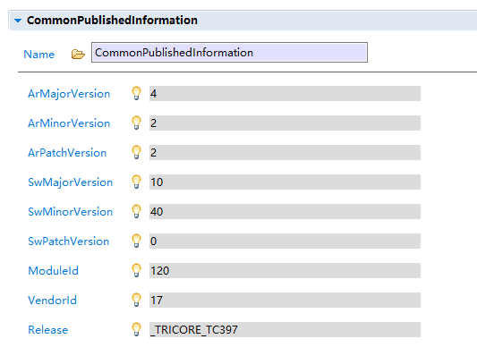


# 使用EB配置CAN驱动

CAN的配置涉及can port mcu irq 这4个模块


上图是配置can的关键，把CanHwObjectCount和CanHwFIFOThreshold全改成2，之后就可以将接收ID的上限由标准帧转为扩展帧；


配置的接收ID会对应一个发送端的发送id，起到过滤的作用，比如can卡想发ID=100的帧，那么接收ID里就需要添加一个接收ID=100的HRH;

而发送帧HTH不需要单独指定ID;


所有发送HTH的CanObjectId必须大于所有的接收HRH, 且can00的HRH必须要小于can01的HRH, can00标准帧和扩展帧间的HRH没有明确的大小关系。

 

 


 

mcu 中时钟的配置：


 

can报文里的PDU（即Protocol Data Unit的缩写），即协议数据单元，是SDU和PCI的组成。一个PDU就是一组完整有明确含义的信息。PDU根据ISO的分层又有明确的称谓，在数据链路层传递的PDU为L-PDU，在网络层传递的PDU为N-PDU，在交互层传递的PDU为I-PDU。


特注：

1：接口 Can_17_McmCan_SetControllerMode 的第一个参数为container：CanController下的成员，即can00-can23，一共12个node；

2：接口 Can_17_McmCan_Write 的第一个参数为container：CanHardwareObject下的CanObjectId成员，每一个成员对应一个can帧的id，且container：CanHwFilter下的CanHwFilterCode成员用于指定can帧id。

3：使用逻辑分析仪测量can信号是须注意：1. 选择CANL和GND对接一路通道； 2. 阈值电压设置为2V（因为CAN差分信号的中位电平是2.5V，测量TTL电平是设置1V即可）； 3. 直接对接发送端会因为逻辑分析仪测量端没有120R终端电阻产生回波，从而在逻辑分析仪上收到多帧数据，因此需要连接接收端，在完整的can网络上用逻辑分析仪去测量。

4：扩展帧模式下先将CanHwObjectCount改为2，之后修改CanHwFilterMask为0x1FFFFFFF，之后再将CanHwObjectCount改为1

5：mix模式下0x0a和0x280000的关系，即完整扩展ID0x280000的前11位正好是0xa；

 

mcu 中时钟的配置：


 

标准帧：


 

扩展帧：


 

混合帧：


 

TC397 CAN message ram


当然一般不这么搞, 比如我这里只用了CAN22, 其它路不用, 完全可以分多点资源来用:

32 个 11-bit filter elements
16 个 29-bit filter elements
20 个 Rx FIFO 0 elements
20 个 Tx Buffer elements

```c
#define MODULE_CAN0_RAM    0xF0200000
#define MODULE_CAN1_RAM    0xF0210000
#define MODULE_CAN2_RAM    0xF0220000
#define NODE0_RAM_OFFSET   0x0
#define NODE1_RAM_OFFSET   0x1000
#define NODE2_RAM_OFFSET   0x2000
#define NODE3_RAM_OFFSET   0x3000

g_mcmcan22.canNodeConfig.messageRAM.baseAddress = MODULE_CAN2_RAM;
//Standard Frame, 32 elements => 32 words => 128 Bytes => 0x80
g_mcmcan22.canNodeConfig.messageRAM.standardFilterListStartAddress = 0x0 + NODE2_RAM_OFFSET;
//Extended Frame, 16 elements => 32 words => 128 Bytes => 0x80
g_mcmcan22.canNodeConfig.messageRAM.extendedFilterListStartAddress = 0x80 + NODE2_RAM_OFFSET;
//RxFIFO0, 20  elements => 360 words => 1440 Bytes => 0x5A0
g_mcmcan22.canNodeConfig.messageRAM.rxBuffersStartAddress = 0x100 + NODE2_RAM_OFFSET;
//Tx FIFO Buffers, 20  elements => 360 words => 1440 Bytes => 0x5A0
g_mcmcan22.canNodeConfig.messageRAM.txBuffersStartAddress = 0x6A0 + NODE2_RAM_OFFSET;
//Total: 128 + 128 + 1440 + 1440 = 3136 Bytes => 0xC40 Bytes
```


# 使用EB配置LIN驱动

详细配置：LIN模块涉及mcu port irq lin 这4个模块

mcu 中需要配置如下


 

port 中需要配置如下：使用EVB板上资源LIN1, PORT15 的 pin0 和 pin1


 

irq 中需要配置发送，接收，错误 这三个中断


 

lin 中配置如下：使用控制器1，波特率19200,


 


# 使用EB配置Irq驱动

1. 概述
   1. IRQ驱动程序为中断配置、初始化和处理提供必要的配置参数和api。

驱动负责:

•配置服务请求的优先级号码

•用于初始化具有配置优先级和服务提供者(CPUx，DMA，其中x从0变化到可用核数)

•用于初始化具有配置优先级和服务提供者的通用服务请求节点的运行时api，可用于软件触发服务请求

•用于清除srn的服务请求标志的运行时api

•如果选择了CAT2，操作系统应该注意中断处理

 

1. 配置预览

container：IrqGeneral 中包含中断的通用配置；

IrqOsekEnable 用于指定是否启用操作系统，选择true表示使用操作系统，同时允许用户配置CAT2类型中断，选择false表示不使用操作系统，且只能配置CAT1类型中断；

IrqGPT120Config 用于指定GPT120外设驱动的中断详细配置，本例中未使用GPT120外设中断；同理其余IrqXXXConfig都是用于指定具体外设中断的详细配置；


 

每一个外设中断的配置均包含3个container；

container：IrqXXXCatConfig 用于指定具体中断的类别，可选CAT1 或 CAT2；

container：IrqXXXPrioConfig 用于指定具体中断的优先级，取值范围是[0, 255]，数值越大表示中断优先级越高；

container：IrqXXXTosConfig 用于指定具体中断有谁负责处理，DMA 或 CPU0~CPU5；


 

IrqQSPIConfig 用于指定QSPI外设驱动的中断详细配置；本例中只使用

了QSPI0外设，因此需要配置IrqQSPIConfig_0；下面3个图依次描述了      QSPI0中断的Cat配置，Prio配置和Tos配置；


 

container：CommonPublishedInformatica 中是软件自动生成的版本号默认值，用户无需修改，保持默认即可。


# 使用EB配置Spi驱动

1. 概述
   1. SPI驱动程序只在主模式和全双工通信模式下工作。驱动程序支持同步和异步通信，支持Level-0, Level-1和Level-2类型配置。
   2. Level等级和同/异步通信，传输seq，传输job，传输channel的配置息息相关。这里的同/异步不是指SPI通信，而是驱动内部数据流的处理模式，是直接同步的由cpu去收发收据，还是由irq和dma组合在后台异步地收发数据的模式。

 

1. 依赖资源


由上图可知spi驱动模块需要依赖的驱动模块包括Mcu，Port，McalLib，Irq和Dma。

 

Mcu 中的配套设置选择时钟源SEL1，外设核心时钟80MHz

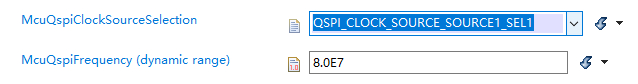

 

Port 中的配套设置物理4线的输出和复用模式：

SPI主从模式切换：主模式下配置CS，CLK，MOSI 对用的pin为输出，且设置合适的复用值，同时配置MISO对应的pin为输入即可；从模式下配置MISO对应的pin为输出，且设置合适的复用值，同时配置CS，CLK，MOSI 对用的pin为输入即可。

主模式：

从模式：


关键信息： QSPI0，SLSO12中的12， MRSTC中的C，复用模式O4，CS低有效，从机工作在模式3 ：Clock空闲高电平(CPOL=1) , 相位LEADING(CPH=1)

 

1. 配置预览


Spi的配置主要包括SpiDriver，SpiGeneral，SpiHwConfiguration这3个主要的container，下面依次详解。

 

container：SpiGeneral 中包含Spi的一些通用配置，关闭错误侦测，关闭安全模式，失能部分接口API, 设置操作模式为SUPERVISOR， 禁止中断打断传输seq等。


 

SpiChannelBuffersAllowed 用于选择数据buffer是采用IB还是EB的方式，即内部buffer还是外部buffer，取值与实际含义见下图，关于IB和EB的区别请查阅文档。


 

SpiLevelDelivered 用于选择spi工作的Level，Level-0仅支持同步数据传输，Level-1仅支持异步数据传输，Level-2既支持同步数据传输，又支持异步数据传输，取值与实际含义见下图。


 

container：SpiChannel 中创建了2个传输通道，传输通道即可用于同步传输，也可用于异步传输；

SpiChannelType 选择IB，表示使用内部buffer；

SpiDataWidth选择8，表示传输数据为8位宽；

SpiIbNBuffers选择10，表示一个IB的容量是10个SpiDataWidth；如果SpiDataWidth=8，则表示一个IB的容量是10字节；如果SpiDataWidth=32，则表示一个IB的容量是40字节；

SpiEbMaxLength 表示 SpiChannelType选择EBbufer时，单buffer的最大数据量，只有SpiChannelType选择EB时，才需要考虑此值；

SpiTransferStart表示数据传输是MSB/LSB；

SpiDefaultData 表示代码中如果数据buffer指针为NULL时，spi总线上真实发送的数据。


 

container：SpiExternalDevice 中包含了外部连接的从机的配置；

SpiBaudrate 表示主机和从机用640000Hz的波特率通信；

SpiCsIdentifier 选择CHANNEL12 表示使用cs通道12（依据是前面关键信息中SLSO12中的12）；

SpiCsPolarity 选择LOW表示cs为low电平时选中从机；

SpiCsSelection选择 CS_VIA_PERIPHERAL_ENGINE表示cs由物理外设驱动，即硬件cs，如果选择CS_VIA_GPIO则表示cs由软件控制gpio去模拟；

SpiDataShiftEdge 选择LEADING 表示空闲时时钟相位为1，选择TRAILING 表示空闲时时钟相位为0；

SpiEnableCs 选择true表示启用片选信号线cs；

SpiHwUnit 选择QSPI0 表示使用物理spi控制器0；

SpiCsGpio 只有在SpiCsSelection选择CS_VIA_GPIO时才需要填充软件模拟cs的gpio的信息；

SpiAutoCalcBaudParameter 选择true表示控制器自动计算波特率设置时需要的各参数的值，建议选择true；

SpiBaudrateParams 只有在SpiAutoCalcBaudParameter选择false时才需要手动填充设置波特率时需要的各参数的值；

SpiShiftClockIdleLevel 选择HIGH表示空闲时时钟极性为1，选择LOW表示空闲时时钟极性为0；

SpiParitySupport 选择UNUSED表示不启用硬件数据流奇偶校验，选择EVEN/ODD则表示启动硬件奇/偶校验；

其余的参数使用默认值即可，更多信息请参阅文档。


生成的配置代码如下：

模式由CPH, CPOL的值决定，模式=CPOL<<1|CPH

 

Sequence， Job， Channel 3者间的关系图：

 

container：SpiJob 中包含了数据传输Job的设置；本例中只创建一个传输Job。

SpiHwUnitSynchronous 选择SYNCHRONOUS表示此Job使用同步模式传输数据，选择ASYNCHRONOUS表示此Job使用异步模式传输数据；

SpiJobEndNotification 用来创建Job传输结束时的回调通知函数，只有SpiHwUnitSynchronous 选择为 ASYNCHRONOUS时该选项才可以配置，同时在代码中用户需要完善此函数的实现；

SpiJobId 由软件自动生成，表示Job的序号，从0开始计；

SpiFrameBaseCS 选择true表示MOSI的数据由CS拉低触发传输，选择false则不受cs触发，这里默认选择false；

SpiJobPriority 用来指定Job的优先级，优先级会影响Job在Sequence队列中的排序位置，默认选择0即可；当有多个Job时，各Job的优先级必须互不相同；

SpiDeviceAssignment 用来将此Job分配给真实的物理从机设备，本例中是前面配置的SpiExternalDevice_0;

SpiChannelList 中列出从属于本Job的所有Channel，分别是SpiChannel_0和SpiChannel_1；


 

container：SpiSequence 中包含了数据传输Sequence的设置；本例中只创建一个传输Sequence。

SpiInterruptibleSequence 选择false表示不支持中断打断seq的传输，选择true表示允许中断打断seq的传输，默认选择false禁止中断打断seq的传输，不论同步传输还是异步传输；

SpiSeqEndNotification 用来创建Sequence传输结束时的回调通知函数，只有SpiHwUnitSynchronous 选择为 ASYNCHRONOUS时该选项才可以配置，同时在代码中用户需要完善此函数的实现；

SpiSequenceId 由软件自动生成，表示Sequence的序号，从0开始计；

SpiJobAssignment 用来表示此Sequence下包含的Job，本例中SpiJob_0将被分配到SpiSequence_0下；


 

container：SpiMaxChannel 由软件自动计算用户总共配置的Channel数目，配置完全部的Channel之后，再配置此项；

container：SpiMaxJob 由软件自动计算用户总共配置的Job数目，配置完全部的Job之后，再配置此项；

container：SpiMaxSequence 由软件自动计算用户总共配置的Sequence数目，配置完全部的Sequence之后，再配置此项；


 

container：SpiHwConfiguration 中包含了Spi主机的配置，这里只实现了一个主机配置，即SpiHwConfigurationQspi_0；

SpiHwConfigKernal 用来选择物理控制器，本例中选择QSPI0作为Spi通信主机；

SpiJobQueueLengthQspix 用来指定Job队列支持的最大成员数目，使用默认值2即可；

SpiSleepEnableQspix 选择false表示禁止spi控制在空闲时进入Sleep模式，选择false表示允许spi控制在空闲时进入Sleep模式，使用默认值false禁止进入sleep；

SpiHWPinMRSTQspix 用来指定miso引脚定义，依据前面关键信息中的MRSTC中的C，在这里选择MRST0C_PORT22_PIN6，表示用Port22_Pin6用作miso引脚；

SpiExternalDemux 选择false表示禁止外部器件矩阵复用，选择true表示允许外部器件矩阵复用，因为外部从机只有一个，因此这里选择false禁止外部器件复用；

SpiSLSO0StrobeDelay 表示cs的强制延时值，这里使用默认值即可；

SpiHwDmaConfigurationQspi 用来分配Dma的通道，此项只有在SpiLevelDelivered选择1/2时且SpiHwUnitSynchronous 选择ASYNCHRONOUS时才允许配置，同时需要在DMA和irq中提前完成相关的配置，有关Dma和Irq的配置，请参阅Dma和Irq的配置说明文档；


 

container：SpiPublishedInformation 用来指定芯片支持的硬件spi控制器的数目，使用软件自动计算的默认值6即可；


 

container：CommonPublishedInformatica 中是软件自动生成的版本号默认值，用户无需修改，保持默认即可。


 

上面的配置是同步模式的配置截图，下面提供异步模式区别于同步模式额外新增的配置项截图：

1. 在dma中创建2个通道，一个数据发送通道，一个数据接收通道，同时数据接收通道中须添加回调函数，发送通道不需要


 

1. 在SpiHwDmaConfigurationQspi 中添加Dma接收和发送通道的分配


 

1. 中断优先级的配置，需要遵循以下规则。 DMA.ERR > SPIx.PT > SPIx.ERR > SPIx.UD > SPIx.Tx > SPIx.Rx；同时SPIx.Tx和SPIx.Rx的值等同于二者所使用的DMA的channel号， 同时这两个dma-channel的优先级要保证dam.tx_channel > dma.rx_channel；

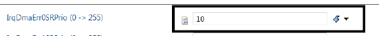


 

1. 接收和发送的中断处理分配给dma


 

物理验证：使用1个Sequence，1个Job，2个Channel 环回模式下同步传输20字节数据的波形图：


 

## 嵌入式开发实战系列：QSPI Flash驱动功能解析

### 前言

首先，请问大家几个小小问题，你清楚：

- QSPI协议的基本内容与功能应用场景吗？
- QSPI Flash驱动读写过程中存在哪些不一样的操作模式呢？
- 基于AUTOSAR架构下Flash驱动接口有哪些？
- 在平常使用QSPI Flash接口的过程中存在哪些注意事项呢？

今天，我们来一起探索并回答这些问题。为了便于大家理解，以下是本文的主题大纲：


------

### 正文

#### QSPI协议介绍

QSPI全称为“**Queued SPI**”，本质上是属于SPI协议的一种，一般来说，**SPI协议可以分为Standard SPI，Dual SPI，以及本文要讲解的Queued SPI**。只不过Dual SPI，Queued SPI常用于作为SPI Flash的通信接口。

##### 功能应用

QSPI作为一种队列串行外围接口协议，就是对SPI协议的扩展，可以通过单线，双线或四线模式与外部Flash存储器进行高速通信。其功能应用场景如下：

- **数据存储**：可以用来实现大量数据的存储，如代码，图像，视频等，从而提高数据的读写速度与容量；
- **代码执行**：QSPI用于执行外部Flash存储器的代码，这样可以节约内部Flash的空间，如通过QSPI XIP模式从而实现在Memmap下执行代码；
- **与其他外围设备进行通信**：QSPI也可支持与其他QSPI协议的外围设备进行通信，如传感器，显示器等，可以提高通信的效率与灵活性；

**协议特点**

- QSPI协议作为一种SPI协议的扩展，一般而言，可以分为两种工作模式，即设置模式与Memmap模式，虽然也有些芯片存在三种，如STM32，不同芯片存在些许差异可以理解，本质上可以归纳为上述两者；
- QSPI协议的命令序列包括**指令、地址、交替字节、空指令和数据**这五个阶段，任一阶段均可跳过，但**至少要包含指令、地址、交替字节或数据阶段之一**；
- 一般而言，**QSPI仅支持dual read 与quad read模式，不支持dual write与quad write两种模式**，同时也不会存在QSPI 输入与输出的loop back模式；


#### QSPI Flash驱动说明

虽然市面上存在许多的Flash驱动供应商，但是基本都大同小异，本文已TI系列的QSPI Flash驱动介绍举例给大家介绍下其QSPI的硬件实现原理，读写操作模式以及EDMA搬运等操作。

**QSPI硬件实现原理**

作为QSPI通信的双方，本质上来讲都是主芯片端作为主设备，可以通过控制CS引脚来决定与外围不同的Flash芯片进行通信，同时通过输出Clock时钟来完成针对从设备的通信传输控制，如下图所示：


图1 QSPI硬件连接原理(图片来源于TI官方文档)

左图为主芯片的内部QSPI的控制器，右图则为外部的支持QSPI协议的外部Flash，两者之间通过QSPI协议接口连接，包含1个CLK引脚，1个CS引脚与4个用于传输数据的IO引脚。

针对上图中的内容，小T将针对每个引脚做个较为详细的介绍，如下表所示：


图2 QSPI接口引脚功能定义

**QSPI读写操作模式**

通过上述文章我们了解到QSPI存在**3线Single Write/Read模式，4线Single Write/ Read，Dual Read模式，6线Quad Read模式**的6种QSPI读写方式，在具体的项目实际应用过程中，我们一般**推荐正常的写入操作通过4线Single Write来写入，读取操作推荐采用6线Quad Read模式**，**这样才能最大效率的利用Flash硬件自身特性，从而提高通信效率。**

如下图所示为QSPI 控制器的内部组成关系，从中我们可以得出如下几个关键结论：


图3 QSPI控制器接口内部结构(来源于TI官方文档)

- 整个QSPI控制器可以分为**SFI_MM_IF与SPI_CORE**两个模块，其中SFI_MM_IF模块主要负责读写指令，地址以及dummy cycle的个数等，而SPI_CORE主要负责芯片的时钟极性与时钟相位以及传输的长度等；

- SFI_MM_IF接口由以下两个部分组成：

- SFI register control：用来实现上述读写指令的初始化设置；

- SFI translator：将对应的SFI register control中的读写指令发送至SPI_CORE模块来外部Flash；

- SPI_CORE模块则是由如下四个部分组成：

- SPI_CNTIF：SPI Control Interface，用于设置对应的读写指令，时钟极性或相位等，在配置模式下会使用到；

- SPI_CLKGEN：SPI Clock Generator，用于设置通信相关的时钟频率；

- SPI_MACHINE：SPI State Machine，将SPI_CNTIF中的相关读写指令作为输入，然后控制数据的移位发送等；

- SPI_SHIFTER：SPI Data Shifter，用来实现接口信号的捕捉与生成。

- QSPI控制器支持两种配置方式，**一种是Config模式，另外一种则是Memmap方式；对于写入操作不支持Memmap方式仅支持Config模式，对于读取操作推荐使用Memmap方式，这样便可以直接在芯片MCU的Memory Layout中看到相应的外部Flash空间的代码或者数据。**

- 对于QSPI接口的通信双方而言，需要确保两者通信的时钟极性与时钟相位是一致的，时钟极性与时钟相位的组合有如下4种方式：

  

图4 QSPI时钟极性与时钟相位关系图

**QSPI EDMA搬运**

- 当通过QSPI去读取大量数据时，我们推荐使用**Memmap方式读取+EDMA的方式**来完成，因为通过该两种技术手段的结合，我们便可以减小CPU负担，直接让EDMA去执行对应的数据读取操作；
- 有关EDMA的具体实现机理就不再本文进行展开，后续将进行单独讲解，欢迎多多关注小T。

#### AUTOSASR架构下Flash驱动标准接口

小T将AUTOSAR架构下针对Flash驱动的标准接口以及相关需求列举如下，这样在我们使用Flash驱动过程我们能够快速的了解到Flash驱动的关键API的具体功能与作用。


图5 Flash驱动标准接口表

在使用上述标准的AUTOSAR Flash驱动API也有很多需要注意的地方，小T将自己觉得需要特别注意的点列举如下，这也是大家容易忽视的一些点：

- **在使用Flash驱动其他读，写等接口之前，务必需调用Fls_Init完成初始化，否则后续的Flash操作请求将会无效；**
- **如果你使用的是外部Flash并采用QSPI驱动，请务必在Fls_Init之前执行QSPI驱动的初始化，保证一个有效的初始化过程；**
- **在执行Flash写入操作时其写入地址与长度均需要与Flash的Page单位进行对齐，如一般为256字节，具体还是取决于Flash芯片型号；**
- **在执行Flash擦除操作时，需确保其擦除地址与长度与Flash的sector单位进行对齐，如一般为4K，具体还是取决于Flash芯片型号；**
- **Fls_Read, Fls_Write等关键API操作均属于异步操作且不可重入，因此需确保Flash驱动的被操作对象的唯一性，不要应用层与Fee模块冲突，统一通过NVM发送请求来完成Flash的操作；**

#### QSPI Flash驱动使用注意事项

小T在具体的软件开发过程中，也遇到过很多跟Flash驱动操作有关的问题，这些问题往往解决起来非常棘手，因为非常偶发且极难复现。

这类问题更多时候还是我们缺乏防御性编程思维，没有针对Flash可能失效的场景进行全面的考虑，以下小T将我个人针对Flash驱动的几个常见的经验总结列举如下，希望能给大家后续的Flash驱动开发带来一些帮助与思考。

- **在每次系统启动或者复位的过程中，最为推荐的做法针对外部Flash同步进行reset操作，该操作可以一般存在如下三种方式：**

- - **每次启动或者复位的过程中可通过硬件来操作Flash的上下电操作来完成Flash自身的重置；**
  - **通过软件的方式来拉低Reset引脚来实现外部Flash复位，这种方式需要考虑到引脚复用功能是否可用的可能性；**
  - **通过软件的方式在初始化的过程中通过QSPI通信发送软复位指令让Flash芯片进行重置；**

- **如果需要针对外部的SPI Flash通过QSPI进行通信，需要特别注意该SPI Flash芯片的QE位是否默认使能，如果没有使能，将无法采用QUAD SPI进行通信，因此建议工厂端刷写软件过程中均需要主动设置该QE位或者在软件初始化过程中设置该QE位，该QE位一旦写入掉电也会丢失，仅需写入一次即可；**

- **在执行Flash初始化过程中需要针对Flash外部型号，如Manufacture ID等设备号进行校验，确保不会出现生产过程中出现芯片型号贴错的场景；**

- **在软件运行过程中有时会偶发导致系统跑飞意外执行操作Flash驱动写或者擦除操作导致用户程序遭到破坏，从而软件无法正常启动，因此有必要针对关键应用程序代码空间进行Flash写保护，这样即使程序死机复位后整个系统也能够再次正常启动。**


# 使用EB配置UART驱动

1. 概述
   1. UART驱动程序负责按照UART协议提供通信服务。asclin模块为实现UART协议提供了异步通信的硬件支持。UART驱动程序提供了配置、初始化、数据传输和接收的功能，还提供了可选的特性，如中止传输和中止接收。
   2. asclin模块支持 lin、spi 和 uart 的通信服务。

 

1. 依赖硬件


 

1. 详细配置

container：UartGeneral 中包含uart的通用配置参数；

UartDevErrorDetect 用于指定是否启用开发错误诊断，本例中禁用；

UartRunTimeError 用于指定是否启用运行时错误诊断，本例中禁用；

UatrSafetyEnable 用于指定是否启用安全模式，默认禁用；

UartVersionInfoApi 用于指定是否启用版本信息api接口，默认禁用；

UartInitCheckApi 用于指定是否启用初始化检查api接口，本例中启用；

UartDeInitApi 用于指定是否启用失能api接口，本例中启用；

UartAbortReadApi 用于指定是否启用终止读api接口，本例中启用；

UartAbortWriteApi 用于指定是否启用终止写api接口，本例中启用；

UartClockRef 用于指定模块内核时钟源引用，在MCU下属container：McuPllDistributionSettingConfig中选择使用使用源 ASCLINS_CLOCK_SOURCE_ASCLINSI_SEL1，使用慢速的80MHz作为模块内核时钟；


UartCsrClksel 用于指定波特率逻辑时钟，支持ASCLINF和ASCLINS，由于上面时钟源选择慢速，故这里选择ASCLINS；

UartSleepEnable 用于指定是否启用Sleep模式，默认禁用；

UartIndex 用于指定模块实例标识符，从0开始计，逐增；

UartInitDeInitApiMode 用于指定初始化和反初始化api工作在MCAL_SUPERVISOR即特权模式下；

UartTimeoutCount 用于指定等待硬件超时错误的最大时间(以纳秒为单位)，保持默认最大值即可；

UartMainFunctionReadPeriod 用于指定主函数Uart_MainFunction_Read的轮询周期(以秒为单位)；

UartMainFunctionWritePeriod 用于指定主函数UartMainFunctionWritePeriod的轮询周期(以秒为单位)；


 

container：UartConfigSet 中包含uart模块的具体配置参数；

sub-container：UartChannel 中包含uart通道的配置参数，一组tx和rx构成一个UartChannel；

UartBaudRate 用于指定串口波特率值，本例中115200bps；

UartHwUnit 用于指定该通道使用的真实ASCLIN控制器序号，本例中使用ASCLIN10；

UartChannelId 用于指定通道序号，从0开始计，逐增；

UartAutoCalcBaudParams 用于指定是否启用波特率参数值自动计算，本例中启用，建议启用；

UartChanBaudNumerator 用于指定用于波特率计算的BRG寄存器分子值；

UartChanBaudDenominator 用于指定用于波特率计算的BRG寄存器分母值；

UartChanBaudPrescalar 用于指定用于波特率计算的BITCON寄存器预计算值；

UartChanBaudOverSampling 用于指定用于波特率计算的采样值之上的BITCON寄存器；

UartRxPinSelection 用于指定rx引脚的选择；本例中为Port13_Pin1;

UartCTSEnable 用于指定是否启用CTS流控，默认禁用；

UartCTSPinSelection 用于指定cts引脚的选择；本例中未启用流控无需选择；

UartCTSPolarity 用于指定CTS引脚的有源极性，即cts处于逻辑活动状态时对应的物理电平值；

UartDataLength 用于指定通道的数据帧长，默认使用8，即8bit；

UartStopBits 用于指定停止位个数，默认1个停止位；

UartParityBit 用于指定是否启用奇偶校验以及具体校验方式，本例中禁用，选择NOPARITY；

UartTxChannelMode 用于指定tx通道传输运行模式，支持轮询和中断两种模式，如果选择轮询模式则无需配置Irq；


UartRxChannelMode 同上；

UartTransmitNotifPtr 发送完成通知回调函数；

UartReceiveNotifPtr 接收完成通知回调函数；

UartAbortTransmitNotifPtr 终止发送通知回调函数；

UartAbortReceiveNotifPtr 终止接收通知回调函数；


 

container：McuHardwareResourceAllocationConf 的

sub-container：McuAscLinAllocationConf 中选择 AscLin10 通道使用ASCLIN_CH_USED_BY_UART_DRIVER功能

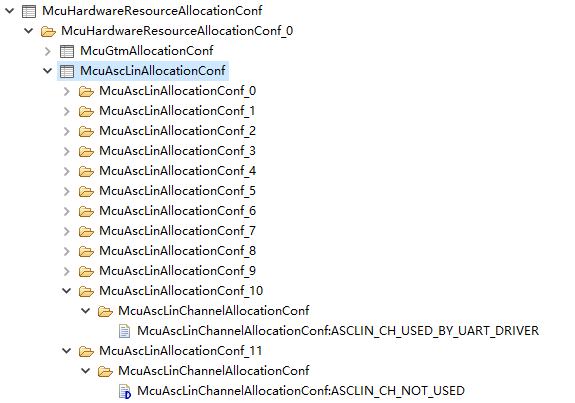

 

container：IrqASCLINConfig 用于指定中断的分类，优先级和处理者；本例中AscLin10的中断分类全选CAT1，处理者全选CPU0，优先级依次选择3个互不相等的非0值；

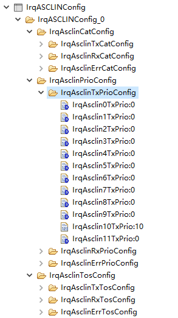

 

PORT中选择Port13的Pin0和1分别作为AscLin10的tx和rx；


 

container：CommonPublishedInformatica 中是软件自动生成的版本号默认值，用户无需修改，保持默认即可。


# 使用EB配置Dma驱动

1. 概述
   1. DMA驱动程序负责提供服务和配置选项，以便使用AURIX DMA硬件执行DMA操作。驱动程序提供了初始化、启动、停止和更新DMA通道的服务。该驱动程序被设计为构建后的变体，可以为特定的所需配置生成十六进制文件。

 

1. 配置预览

container：DmaGeneral 中包含了Dma的通用配置；

DmaDevErrorDetect 是否启用开发错误侦测，本例中禁用；

DmaMultiCoreErrorDetect 是否启用多核错误侦测，本例中禁用；

DmaSafetyEnable 是否启用安全模式，本例中禁用；

DmaInitCheckApi 是否启用初始化检查api，默认禁用；

DmaDeinitApiConfiguration 是否启用失能初始化api，默认禁用；

DmaSuspendApiConfiguration 是否启用挂起配置api，默认禁用；

DmaTriggerApiConfiguration 是否启用翻转api，本例中启用；

DmaDataPendingApiConfiguration 是否启用数据挂起api，默认禁用；

DmaBufferSwitchApiConfiguration 是否启用数据buffer切换api，默认禁用；

DmaVersionInfoApi 是否启用版本信息api，默认禁用；

DmaMaxTransactionSetPerChannel 用于指定每个通道最大的传输集个数，默认为1；

DmaInitApiMode 用于指定初始化api的运行等级为SUPERVISORMODE；

DmaRuntimeApiMode 用于指定运行时api的运行等级为SUPERVISORMODE；


 

container：DmaChannelConfig 中包含了启用的dma通道的详细配置；

DmaChannelId 用于指定启用的dma通道号，本例中使用了通道1和2，因此两个通道的此项值分别是1和2；

DmaChannelAssignedPartition 用于指定该通道分配到的硬件分区，本例中芯片dma支持4个硬件分区，此项的取值范围是[0, 3]；

DmaChannelNumTransactionSet 用于指定通道支持的传输集个数，默认为1；

DmaTcsInterruptTransactionLoss 用于指定是否启用事务丢失中断，默认选择false禁用事务丢失中断；

DmaChannelNotification 用于添加通道传输完成后的回调通知函数，并由用户在代码中实现同名函数；此项非必填项，会依据通道的特性按需添加；比如此通道用作spi的接收就必须要添加回调函数，但如果是用作spi的发送则可添可不添；


 

DmaChannelTransactionSet 中包含数据源，目标源，数据宽度，地址增长方式等的设置，更多信息参阅原始文档；这里使用默认配置即可，实际传输时会由Dma驱动代码对下面参数重新进行正确的赋值；


 

container：DmaMoveEngineConfig 中包含DMA-IP数据移动引擎的配置；

DmaMESourceErrorInterrupt 用于指定是否启用移动引擎源错误中断，默认选择false禁用此中断；

DmaMEDestinationErrorInterrupt 用于指定是否启用移动引擎目标错误中断，默认选择false禁用此中断；

DmaMELinkedListErrorInterrupt 用于指定是否启用移动引擎链表错误中断，默认选择false禁用此中断；


 

container：CommonPublishedInformatica 中是软件自动生成的版本号默认值，用户无需修改，保持默认即可。


 

container：DmaResourcePartition 中包含DMA资源分区相关的配置，本例中芯片dma支持 4 个硬件分区；

DmaResourcePartitionBusMode 该参数定义了资源分区的总线访问模式，选择DMA_RP_SUPERVISOR_MODE表示处于管理模式，选择

DMA_RP_USER_MODE表示处于用户模式；默认选择管理模式；

DmaPermittedBusMaster 该参数是一个32位的16进制掩码，表示允许访问该分区的总线主节点，取值范围是[0, 0xFFFFFFFF]；使用默认值0xFFFFFFFF即可；

DmaMoveEngineErrorNotification 用于添加移动引擎错误后的回调通知函数，并由用户在代码中实现同名函数；默认不需要；

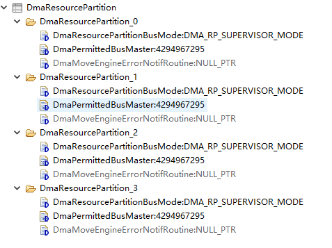

#  使用EB配置PWM驱动

1. 概述
   1. 脉宽调制(PWM)驱动器负责提供与AUTOSAR指定的PWM信号生成相关的标准服务。PWM通道的底层定时器引擎是一个GTM (TOM或ATOM片)或CCU6 (T12或T13片)定时器通道。

 

1. 依赖硬件


 

 

1. 详细配置

container：PwmGeneral 中包含Pwm的通用配置

PwmDevErrorDetect 用于指定是否启用开发错误诊断，本例中禁用；

PwmMultiCoreErrorDetect 用于指定是否启用多核开发错误诊断，本例中禁用；

PwmDutycycleUpdatedEndperiod 用于指定是否在当前周期结束时更新占空比参数，本例中开启；

PwmIndex 模块实例ID，从0计；

PwmLowPowerStatesSupport 是否支持低功耗电源模式，默认不支持；

PwmNotificationSupported 是否支持通知，本例中启用；

PwmPeriodUpdatedEndperiod 用于指定是否在当前周期结束时更新周期参数，本例中开启；

PwmChannelCoherentSelection 是否开启在当前周期结束时按通道更新duty/period参数的开关，默认禁用；

PwmHandleShiftByOffset 是否启用通道移位，默认禁用；

PwmDutyShiftInTicks 用于指定占空比和移位值是绝对的还是相对于周期的，本例中启用，采用绝对值；

PwmEnable0Or100DutyNotification 是否支持0%和100%的固定周期和可变周期通道的通知，本例中开启；

PwmPowerStateAsynchTransitionMode 用于指定是否对异步电源状态转换的支持，默认禁用；

PwmSafetyEnable 用于指定是否启用安全模式，本例中禁用；

PwmInitCheckApi 用于指定是否启用初始化检查api，本例中启用；

PwmPowerStateConfig 用于定义一个电源状态和到达此电源状态时要调用的回调，因为不支持电源模式，默认不可编辑；


 

container：PwmConfigurationOfOptApiServices

PwmDeInitApi 用于指定是否启用失能api，本例中启用；

PwmGetOutputState 用于指定是否启用获取输出状态的api，本例中启用；

PwmSetDutyCycle 用于指定是否启用设置占空比的api，本例中启用；

PwmSetOutputToIdle 用于指定是否启用设置输出空闲状态的api，本例中启用；

PwmSetPeriodAndDuty 用于指定是否启用设置周期和占空比的api，本例中启用；

PwmVersionInfoApi  用于指定是否启用版本信息的api，默认禁用；


 

container：PwmChannelConfigSet 中包含Pwm通道的具体配置，本例中创建了4个通道；


 

sub-container：PwmChannel_0 中包含Pwm通道0的具体配置，其余通道同理；

PwmChannelClass 用于指定PWM波的类型，支持下列4种


PwmChannelId 用于指定通道ID，从0计且值必须是连续的；

PwmAssignedHwUnit 用于指定所使用的硬件资源，GTM或CCU6；

PwmDutycycleDefault 占空比初始值，解释如下：


PwmIdleState 用于指定波形空闲时的电平值，默认低电平；

PwmNotification 指定回调函数名称，并在代码中实现定义，本例忽略；

PwmPeriodDefault 周期初始值，解释如下：


PwmPolarity 用于指定波形极性，默认低电平；

PwmMcuClockReferencePoint 用于指定时钟引用点，本例中忽略；

PwmShiftValue 指定默认偏移值，只对PWM_FIXED_PERIOD_SHIFTED类的波起效；

PwmReferenceChannel 用于指定固定周期波的通道引用，只对PWM_FIXED_PERIOD_SHIFTED和PWM_FIXED_PERIOD_CENTER_ALIGNED 类的波起效；

PwmCoherentUpdate 用于指定是否在当前周期结束时更新duty/period参数，本例中禁用；

GtmTimerOutputModuleConfiguration 中包含了用于配置TOM或ATOM计时器的定时需求的设置；

GtmTimerUsed 用于指定定时器通道，本例中用了Atom0的ch0，故为：/Mcu/Mcu/McuHardwareResourceAllocationConf_0/McuGtmAllocationConf_0/McuGtmAtomAllocationConf_0/McuGtmAtomChannelAllocationConf_0；

GtmTimerClockSelect 用于指定时钟源选择，定义如下:


CCU6CC6Configuration 由于使用的Gtm，因此CCU6无须配置；


 

container：McuHardwareResourceAllocationConf 中包含硬件外设资源的分配；

sub-container：McuGtmAtomChannelAllocationConf 中包含Atom通道的分配；Gtm下属12个Atom，故McuGtmAtomAllocationConf_0 ~ McuGtmAtomChannelAllocationConf_11；每一个Atom下属8个通道，故McuGtmAtomChannelAllocationConf_0 ~ McuGtmAtomChannelAllocationConf_7，本例中只使用了Atom0的前4个通道；

McuGtmAtomChannelAllocationConf 用于指定通道复用情况，支持如下：


McuAtomChannelEventHandledByDsadc 用于指定当事件发生时是否调用DSADC的回调或保留资源的驱动程序，默认禁用；

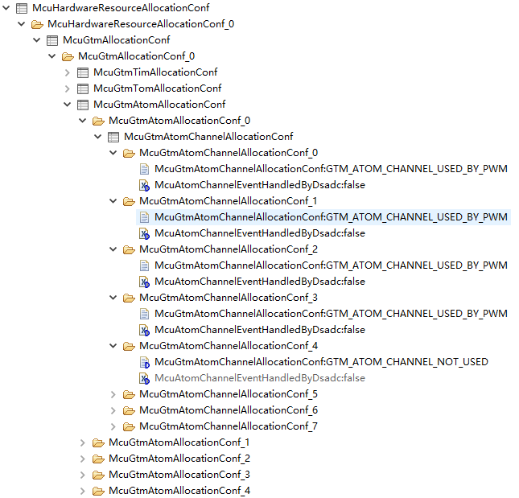

 

sub-container：GtmGlobalConfiguration 中包含Gtm的全局配置；

sub-container：GtmAtomGlobalConf 中包含Gtm下属外设Atom的全局配置；tc397中Gtm下属有12个Atom，故GtmAtomGlobalConf_0 ~ GtmAtomGlobalConf_11，篇幅有限其余未列出，配置相似；

sub-container：GtmAtomChannelConf 中包含Gtm下属外设Atom的具体通道的配置；每一个Atom下属8个通道，故GtmAtomChannelConf_0 ~ GtmAtomChannelConf_7，本例中只使用了Atom0的Ch0~3，其余通道未列出，配置相似；

GtmAtomChResetCn0OnTriggerEnable 用于指定是否启用从任何触发器上重置ATOM通道的CN0寄存器，默认禁用；

GtmAtomChInternalTriggerEnable 用于指定是否启用内部触发，默认禁用；

GtmTimerPortPinSelect 用于指定Gtm_Atom_Ch和Port_Pin的对应关系，每一个Gtm_Atom_Ch支持的pin脚可以在配置项的下拉菜单中选择，用户只需要合理匹配即可；


 

sub-container：PortContainer_2 中包含Pwm输出时使用的物理pin脚的具体配置；

本例中使用Port02的Pin0~3用来输出GTM_TOUT的0~3通道，具体GTM_TOUT通道和PortPin的对应关系请参考引脚文档；配置pin脚的方向为PORT_PIN_OUT，复用模式为ALT1，其他保持默认值即可。


 

GtmCmuClusterInputClockDividerEnable 用于决定定时器时基的主频，

选择CLS_CLK_CFG_ENABLED_WITH_DIV_SEL2 为100MHz；选择

CLS_CLK_CFG_ENABLED_WITHOUT_DIV_SEL1 为200MHz；

 

container：CommonPublishedInformatica 中是软件自动生成的版本号默认值，用户无需修改，保持默认即可。


## AUTOSAR PWM

### 概述

- PWM driver负责配置和初始化MCU的PWM信号的输出；
- PWM channel 对应一个产生PWM信号的硬件和相应的Pin；

### 配置

基于TC397、EB tresos。

### PwmChannel

各个PWM Channel配置。


### PwmAssignedHwUnit

可产生PWM信号的硬件单元，TC397上有GTM和CCU6。

### PwmDutycycleDefault

初始化时，PwmChannel的默认占空比，0~0x8000(32768)，对应 0~100%。

### PwmPeriodDefault

初始化时，PwmChannel的默认周期，>0（unit：s）。

### PwmIdleState

当PWM信号停止输出时的Pin电平（在init之前、在deInit之后、在Pwm_SetOutputToIdle()之后）。

### PwmPolarity

PWM信号的极性。


### PwmChannelClass

PwmChannel的类型，如，可变周期、固定周期等。


### GtmTimerOutputModuleConfiguration

在PwmAssignedHwUnit选定了相应的PwmChannel硬件单元后，需要配置相应的硬件单元，如，GTM，或者CC6U。

GtmTimerUsed：使用的GTM定时器。这里选择GTM_TOM0_IN4。

GtmTimerClockSelect：该定时器的时钟。

GtmTimerPortPinSelect：GTM_TOM0_IN4相对应的引脚。


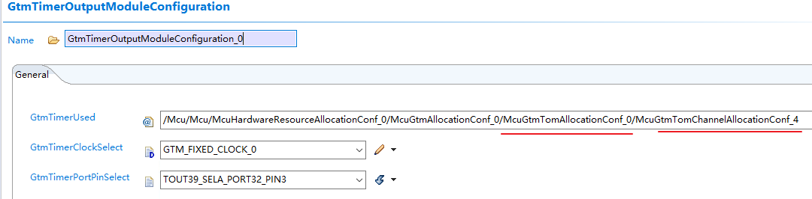


## 简单使用

在配置好后，使用 PwmSetPeriodAndDuty() 即可改变PWM信号的周期和占空比。


# 使用EB配置Fee驱动

1. 1. FEE驱动程序通过标准服务和定义良好的配置根据AUTOSAR提供Flash EEPROM仿真。此外，还提供了客户特定的功能，如原始Flash处理、准静态(QS)数据块支持、未配置数据块支持、擦除暂停恢复。针对第二代AURIXTM硬件，DFlash0 EEPROM内存区域被FEE驱动程序专门用于提供模拟EEPROM功能。特定于dflash的操作，如擦除、读取和写入，都是在FLS驱动程序中实现的。FEE不使用DFlash1。DFlash1为HSM预留。FEE驱动程序是作为Post-Build变体交付的，因为FEE功能不仅可用于运行时应用程序，还可用于引导代码。

  注意:准静态数据区有500个擦除/写入循环的限制。

1. FEE驱动程序实现从FLS驱动程序调用的回调函数。这些功能将在配置FLS驱动程序时配置。FEE驱动程序通过可配置的通知功能报告Job的完成情况和错误。用户可以在配置FEE模块时配置这些功能。

 

1. 依赖硬件


 

1. 详细配置

container：FeeBlockConfiguration 中包含fee驱动中添加的各数据块的配置参数；

FeeBlockNumber 用于指定fee驱动中分配的各存储块的序号，软件自动生成，从1开始计，须小于FeeMaxBlockCount值，本例中创建了3个块，因此序号为1,2,3；

FeeQsBlockInstances 用于指定Qs大块中的小块个数，前提是大块应该是Qs类型的块，本例中块0 和块1 都是NvM类型的数据块，因此这两块的此项值必须为0；块2 是Qs类型的块，因此可以指定此QS大块中包含的小块个数，本例中只设置了一个小块，因此块2 中的此项值为1；更多详细信息请参阅原始文档；

FeeQsBlockAddress 用于指定各块的起始地址，这个地址也是一个DFLASH0中的相对偏移地址，不是真实物理地址，虽然项目名中带有Qs，但不论Qs还是Nvm类型的数据块，均由此项设置起始地址。由于在Fls的配置文档中我们设置NvM块的相对起始地址是0，块大小是0x60000，因此这里NvM类型数据块的相对地址取值范围是[0, 0x60000)；本例创建了两个NvM的小块，起始地址分别是0x10000和0x20000；Fls配置文档中Qs类型数据块的相对起始地址是0xc0000，大小是0x40000，因此这里Qs类型数据块的相对地址取值范围是[0xc0000, 0x100000)；本例中创建了一个Qs小块，起始地址是0xc0000；因此本例中3个数据块此项的值依次是0x10000，0x20000，0xc0000；

FeeQuasiStaticManager 用于指定数据块存储的数据类型，选择true表示此块是Qs块，选择false表示此块是NvM块，因此本例中的3个块此项的值依次是false，false，true；

FeeBlockSize 用于指定块大小，此值须是4096的整数倍；

FeeImmediateData 用于指定数据类型，正常数据设置为FALSE，即时数据设置为TRUE，默认使用false即可；

FeeNumberOfWriteCycles 定义特定逻辑块的写周期计数；它表示一个特定逻辑块可以被写入的最大次数；值为0表示该块不受任何限制，可以根据用户的需要任意写入次数；

FeeDeviceIndex 由于fee是在fls的基础上进行的配置，因此这里需要引用Fls的配置；


 

container：FeeGeneral 中包含fee驱动的通用配置；

FeeDevErrorDetect 是否启用开发错误侦测api，本例中禁用；

FeeSafetyEnable 是否启用安全模式api，本例中禁用；

FeeInitCheckApi 是否启用初始化检查api，默认禁用；

FeeMainFunctionPeriod 设置主函数调度周期值，使用默认值10ms；

FeeNvmJobEndNotification 用于添加NvM块Job传输结束后的回调通知函数，并由用户在代码中实现同名函数；

FeeNvmJobErrorNotification 用于添加NvM块Job传输错误后的回调通知函数，并由用户在代码中实现同名函数；

FeeQsJobEndNotification 用于添加Qs块Job传输结束后的回调通知函数，并由用户在代码中实现同名函数；

FeeQsJobErrorNotification 用于添加Qs块Job传输错误后的回调通知函数，并由用户在代码中实现同名函数；

FeePollingMode 是否启用模块的轮询模式，由于英飞凌FEE的实现仅在非轮询模式下工作。因此，默认值设置为FALSE，且不可变更；

FeeSetModeSupported 是否启用FEE模块的SetMode功能，本例中禁用；

FeeVersionInfoApi 是否启用版本信息api，默认禁用；

FeeVirtualPageSize 用于指定对逻辑块进行对齐的字节大小，此值默认是8且不可变更；

FeeBlockTypeConfigured 用于指定数据块类型配置分类，支持3种模式，分别是FEE_DOUBLE_SECTOR_AND_QUASI_STATIC_DATA ，

FEE_DOUBLE_SECTOR_DATA_ONLY 和 FEE_QUASI_STATIC_DATA_ONLY；本例中既支持NvM又支持Qs，因此选择FEE_DOUBLE_SECTOR_AND_QUASI_STATIC_DATA；


 

container：FeePublishedInformation 中包含fee驱动的信息，这里采用默认值即可；


 

container：FeeIfxSpecificConfig 中包含fee驱动适用于英飞凌的特殊配置；

FeeThresholdValue 用于指定触发垃圾收集/扇区更改的阈值，默认200；

FeeMaxBlockCount 用于指定fee中分配块总数的最大值，跨配置共享的块只计算一次，且此值须大于FeeBlockNumber中的最大值；

FeeUseEraseSuspend 是否启用擦除挂起的特性，默认禁用；

FeeStateVarStructure 此参数用于提供包含特定于fee驱动程序的整个全局变量的结构的名称，用户可以修改（建议使用默认值），并在代码中以静态全局变量的形式存在；

FeeUnConfigBlock 用于指定在GC期间是否应将未配置的块复制到新扇区或忽略；选择FEE_UNCONFIG_BLOCK_IGNORE表示忽略；选择FEE_UNCONFIG_BLOCK_KEEP表示复制；

FeeUnConfigBlkOverflowHandle 用于指定当缓存表溢出时fee驱动的行为，选择FEE_CONTINUE表示未配置的块不能容纳在缓存表在GC后丢失；选择

FEE_STOP_AT_GC表示在GC过程中FEE进入伪非法状态，只允许读操作，不允许写操作；

FeeGcRestart 用于指定GC重启点，选择FEE_GC_RESTART_INIT表示在fee初始化完成后进行GC重启；选择FEE_GC_RESTART_WRITE表示在Job被请求时进行GC重启；

FeeGetCycleCountApi 是否启用获取周期计数api，默认禁用；

FeeEraseAllEnable 是否启用全部擦除功能，默认禁用；

FeeGetPrevDataApi 是否启用获取先前数据api，默认禁用；

FeeCancelAllApi 是否启用取消全部操作api，默认禁用；

FeeMaxBytesPerCycle 用于指定在读、写和比较操作期间，在一次fee主函数调用中处理的最大数据字节数；

FeeNvmIllegalStateNotification 用于添加NvM块处于非法状态时的回调通知函数，并由用户在代码中实现同名函数；

FeeQsIllegalStateNotification 用于添加Qs块处于非法状态时的回调通知函数，并由用户在代码中实现同名函数；

FeeQsHardenErrorNotification 用于添加Qs块硬件错误时的回调通知函数，并由用户在代码中实现同名函数；

FeeVirginFlashIllegalState 是否启用检测原始Flash (DFlash0)的行为，默认禁止；


 

container：FeeDemEventParameterRefs 中包含fee驱动涉及的诊断事件集合，需要在Dem中配套设置，本例中关闭了诊断事件管理，因此使用默认值，均无须配置；


 

container：CommonPublishedInformatica 中是软件自动生成的版本号默认值，用户无需修改，保持默认即可。


# 使用EB配置ADC驱动

## 1、使用EB配置ADC驱动

**ADC HW Unit**：硬件转换单元，即在MCU中具备所有模数转换所需组件的一个单元；
**ADC Group**：ADC转换组，所有Group中的AD通道触发源相同，且ADC的转换也是以Group为单位进行；
**Channel**：AD通道，每个AD通道采集的AD值可对应单个或多个Port口。

ADC HW Unit、ADC Group、Channel及Port的对应关系总结如下：
MCU中包含一个或多个ADC HW Unit；
每个HW Unit包含一个或多个ADC Group；
每个ADC Group包含一个或多个Channel；
一个Channel可能对应一个或多个输入Port。

**Single-Access**：在Buffer中只能保存最近一次的转换结果；
**Streaming-Access**：在Buffer中可以保存多次采样的结果；


ADC驱动程序负责提供指定的AUTOSAR标准模数转换服务，使用逐次逼近寄存器(SAR)原理将模拟输入值(电压)转换为离散数字值；涉及 MCU GTM ADC这3个模块。


 

container：GtmTomChannelConf


 

container：GtmTriggerForAdc


 

container：McuGtmTomChannelAllocationConf


注释1：8路ADC主组 和 4路ADC次组，OUT0的SEL7对TRIG0[7]；OUT1的SEL0对TRIG0[8]；

注释2：EVADC，DSADC；ADCTRIG1-3支持EVADC，DSADC；ADCTRIG4仅支持EVADC；

注释3：GtmTriggerForAdc中的ADC外设号会决定ADC_TRIGx[7:0]还是ADC_TRIGx[11:8]，即能决定ADCTRIG0OUTx.SELy中的x和y；其内GtmAdcTriggerXSelect决定ADC_TRIGX中的x；GtmAdcTriggerxSelect的16个下拉值会决定指定SELx的取值，即16条输入线的那条能过去；因此ADC9的GtmAdcTrigger3Select的下拉值会体现在寄存器ADCTRIG3OUT1.SEL1上；


 

GtmTriggerForAdc_8 ：GtmAdcTrigger0Select


## [2、AUTOSAR ADC](https://www.cnblogs.com/devilanwen/articles/17141009.html)

### 概述


### 配置概述

基于TC397、EB tresos 23.00。

1. 首先，在 AUTOSAR PORT 的配置中将相应的 Pin 配置为复用，并配置相应的电气属性；
2. 在 AUTOSAR ADC 中对 ADC 进行配置；

### 配置 AUTOSAR ADC

#### General

**AdcSystemClock**：ADC 时钟，配置来自MCU模块。

**AdcResultAlignment**：采样结果对齐方式。

**AdcMaxChConvTimeCount** (0 -> 16962) ：ADC channel 的最大转换时间，单位：1/(ADC时钟/ADC分频系数)。

**AdcChannelValueSigned**：ADC channel 采样值是否是符号数。

**AdcMaxChannelResolution**：ADC channel 采样的精度（按bit）。


#### AdcHwUnit

AdcHwUnit中的每一条对应MCU中的一个 ADC 硬件，如TC397的ADC0（G0）。


**AdcPrescale**：该ADC硬件的预分频系数，该AdcHwUnit的时钟频率 = AdcSystemClock / AdcPrescale。

**AdcHwUnitInputClass**：在这配置ADC channel 的采样时间。


#### AdcChannel

AdcHwUnit下的 ADC 通道。

如：AdcHwUnit_0/AdcChannel_0对应TC397的ADC0/CH0(G0CH0)。

**AdcAnChannelNum**：具体的ADC硬件通道。

**AdcInputClassSelection**：这里引用AdcHwUnitInputClass，含通道采样时间。


#### AdcGroup

- **AdcGroupAccessMode**：AdcGroup 结果访问模式，如：ADC_ACCESS_MODE_STREAMING（流模式）、ADC_ACCESS_MODE_SINGLE（单模式）。
- **AdcGroupConversionMode**：AdcGroup 转换模式，连续转换（ADC_CONV_MODE_CONTINUOUS）、单次转换（ADC_CONV_MODE_ONESHOT）。
- **AdcGroupTriggSrc**：AdcGroup 转换的触发模式：硬件触发、软件触发。
- **AdcStreamingBufferMode**：AdcGroup Buffer 的形式，线性。
- **AdcStreamingNumSamples** (1 -> 255)：AdcGroupAccessMode和AdcStreamingNumSamples 决定用户需要提提供的result buffer的大小。AdcGroupAccessMode = ADC_ACCESS_MODE_STREAMING，则result buffer = 通道数 * AdcStreamingNumSamples；AdcGroupAccessMode = ADC_ACCESS_MODE_SINGLE，则result buffer = 通道数。
- **AdcNotification**：Notification（类似中断）函数，当一轮转换（组中全部通道转换完成）后，中断触发，然后该Notification会被调用。
- **AdcGroupDefinition**：该组所含的ADCChannel。
- AdcHwTrigSignal：当该通道是硬件触发时，需配置触发信号。
- EruTriggerConfig/EruGatingConfig/GtmTriggerTimerConfig/GtmGatingTimerConfig：当该通道是硬件触发时，需配置其中一个。


### 软件触发的AdcGroup使用简述

1. 根据配置定义result buffer，uint16 AdcSWGroup0_resultBuffer[通道数][AdcStreamingNumSamples]。如，以上配置：uint16 AdcSWGroup0_resultBuffer[8][5]。
2. Enable AdcGroup：Adc_EnableGroupNotification(AdcConf_AdcGroup_AdcSWGroup_0);
3. Set result buffer for AdcGroup：Adc_SetupResultBuffer(AdcConf_AdcGroup_AdcSWGroup_0, (void *)AdcSWGroup0_resultBuffer);
4. Start AdcGroup conversion：Adc_StartGroupConversion(AdcConf_AdcGroup_AdcSWGroup_0);
5. 一轮转换完成（全部通道完成一次转换）后，触发中断，中断调用Notification，在Notification中可添加用户代码，如，Stop AdcGroup conversion。
6. Stop AdcGroup conversion：Adc_StopGroupConversion(AdcConf_AdcGroup_AdcSWGroup_0);
7. Access result：Adc_GetStreamLastPointer()/Adc_ReadGroup(); 或者直接访问 AdcSWGroup0_resultBuffer[8][5]；
8. Set result buffer for AdcGroup：Adc_SetupResultBuffer(AdcConf_AdcGroup_AdcSWGroup_0, (void *)AdcSWGroup0_resultBuffer);
9. Start AdcGroup conversion：Adc_StartGroupConversion(AdcConf_AdcGroup_AdcSWGroup_0);
10. ......


## 3、基于TC397的MACL-ADC配置

#### 文章目录

- [【搞一点AUTOSAR】基于TC397的MACL-ADC配置解读（使用EB）](https://blog.csdn.net/qq_44688936/article/details/127752952?spm=1001.2101.3001.6650.2&utm_medium=distribute.pc_relevant.none-task-blog-2~default~CTRLIST~Rate-2-127752952-blog-118944837.235^v38^pc_relevant_sort_base2&depth_1-utm_source=distribute.pc_relevant.none-task-blog-2~default~CTRLIST~Rate-2-127752952-blog-118944837.235^v38^pc_relevant_sort_base2&utm_relevant_index=5#AUTOSARTC397MACLADCEB_0)
- [前言](https://blog.csdn.net/qq_44688936/article/details/127752952?spm=1001.2101.3001.6650.2&utm_medium=distribute.pc_relevant.none-task-blog-2~default~CTRLIST~Rate-2-127752952-blog-118944837.235^v38^pc_relevant_sort_base2&depth_1-utm_source=distribute.pc_relevant.none-task-blog-2~default~CTRLIST~Rate-2-127752952-blog-118944837.235^v38^pc_relevant_sort_base2&utm_relevant_index=5#_7)
- [一、ADC模块介绍](https://blog.csdn.net/qq_44688936/article/details/127752952?spm=1001.2101.3001.6650.2&utm_medium=distribute.pc_relevant.none-task-blog-2~default~CTRLIST~Rate-2-127752952-blog-118944837.235^v38^pc_relevant_sort_base2&depth_1-utm_source=distribute.pc_relevant.none-task-blog-2~default~CTRLIST~Rate-2-127752952-blog-118944837.235^v38^pc_relevant_sort_base2&utm_relevant_index=5#ADC_17)
- - - [1、ADC模块的功能](https://blog.csdn.net/qq_44688936/article/details/127752952?spm=1001.2101.3001.6650.2&utm_medium=distribute.pc_relevant.none-task-blog-2~default~CTRLIST~Rate-2-127752952-blog-118944837.235^v38^pc_relevant_sort_base2&depth_1-utm_source=distribute.pc_relevant.none-task-blog-2~default~CTRLIST~Rate-2-127752952-blog-118944837.235^v38^pc_relevant_sort_base2&utm_relevant_index=5#1ADC_21)
    - [2、模块相关概念首字母缩略介绍：](https://blog.csdn.net/qq_44688936/article/details/127752952?spm=1001.2101.3001.6650.2&utm_medium=distribute.pc_relevant.none-task-blog-2~default~CTRLIST~Rate-2-127752952-blog-118944837.235^v38^pc_relevant_sort_base2&depth_1-utm_source=distribute.pc_relevant.none-task-blog-2~default~CTRLIST~Rate-2-127752952-blog-118944837.235^v38^pc_relevant_sort_base2&utm_relevant_index=5#2_26)
- [二、基于TC397的EB_MCAL_ADC模块介绍](https://blog.csdn.net/qq_44688936/article/details/127752952?spm=1001.2101.3001.6650.2&utm_medium=distribute.pc_relevant.none-task-blog-2~default~CTRLIST~Rate-2-127752952-blog-118944837.235^v38^pc_relevant_sort_base2&depth_1-utm_source=distribute.pc_relevant.none-task-blog-2~default~CTRLIST~Rate-2-127752952-blog-118944837.235^v38^pc_relevant_sort_base2&utm_relevant_index=5#TC397EB_MCAL_ADC_47)
- - [1.Config Variant与AdcConfigSet](https://blog.csdn.net/qq_44688936/article/details/127752952?spm=1001.2101.3001.6650.2&utm_medium=distribute.pc_relevant.none-task-blog-2~default~CTRLIST~Rate-2-127752952-blog-118944837.235^v38^pc_relevant_sort_base2&depth_1-utm_source=distribute.pc_relevant.none-task-blog-2~default~CTRLIST~Rate-2-127752952-blog-118944837.235^v38^pc_relevant_sort_base2&utm_relevant_index=5#1Config_VariantAdcConfigSet_48)
  - [2. AdcGeneral](https://blog.csdn.net/qq_44688936/article/details/127752952?spm=1001.2101.3001.6650.2&utm_medium=distribute.pc_relevant.none-task-blog-2~default~CTRLIST~Rate-2-127752952-blog-118944837.235^v38^pc_relevant_sort_base2&depth_1-utm_source=distribute.pc_relevant.none-task-blog-2~default~CTRLIST~Rate-2-127752952-blog-118944837.235^v38^pc_relevant_sort_base2&utm_relevant_index=5#2_AdcGeneral_61)
  - [3.AdcPublishedInformation](https://blog.csdn.net/qq_44688936/article/details/127752952?spm=1001.2101.3001.6650.2&utm_medium=distribute.pc_relevant.none-task-blog-2~default~CTRLIST~Rate-2-127752952-blog-118944837.235^v38^pc_relevant_sort_base2&depth_1-utm_source=distribute.pc_relevant.none-task-blog-2~default~CTRLIST~Rate-2-127752952-blog-118944837.235^v38^pc_relevant_sort_base2&utm_relevant_index=5#3AdcPublishedInformation_135)


##### 一、前言

本文描述的配置基于[英飞凌](https://so.csdn.net/so/search?q=英飞凌&spm=1001.2101.3001.7020)TC397芯片，ADC模块是MCAL相当重要的部分，本文先对模块，API函数等做基本介绍，下一篇描述如何完成基本的ADC配置


**一、ADC模块介绍**

###### 1、ADC模块的功能

初始化并控制微控制器的内部模拟数字转换器单元(s)。它提供启动和停止转换的服务，以启用和禁用转换的触发源。此外，它还提供服务来启用和禁用通知机制和例程，以查询转换的状态和结果。

ADC模块在的ADC通道组上工作，这是由的ADC通道构建的。ADC通道组将模拟输入引脚（ADC Channel）、所需的ADC电路本身和转换结果寄存器组合成一个实体，它可以通过ADC模块进行单独控制和访问。

###### 2、模块相关概念首字母缩略介绍：

**DEM** ：Diagnostic Event Manager 诊断事件管理
**DET** ：Default Error Tracer 默认错误跟踪器
**ADC** :Analogue Digital Converter 模数转换器
**MCU** :Microcontroller Unit 微控制器管理单元
**API** :Application Programming Interface 应用程序接口
**HW** :Hardware 硬件
**SW** :Software 软件
**ADC HW Unit** : ADC硬件模块，表示一种微控制器输入电子设备，它包括执行“模拟到数字转换”所需的所有部件。
**ADC Module** ：ADC基本软件模块ADC驱动程序，也缩写为ADC驱动程序
**ADC Channel** ：表示绑定到一个端口引脚的逻辑ADC实体。多个ADC实体可以映射到同一个端口引脚。
**ADC Channel Group** ：连接到同一ADC硬件单元的一组ADC通道（例如，一个采样和保持转换器和一个A/D转换器）。整个组的转换是由一个触发源触发。
**ADC Result Buffer (ADC Streaming Buffer, ADC Stream Buffer)** ：ADC驱动程序的用户必须为每个组提供一个缓冲区。如果选择了流媒体访问模式（streaming access mode）该缓冲区可以保存同一组通道的多个样本。如果选择了单一访问模式，缓冲组中保留每个通道的一个样本。
**Software Trigger** ：启动一个ADC通道组或连续一系列ADC通道组转换的软件API调用
**Hardware Trigger** ：启动ADC通道组的一次转换的ADC内部触发信号。ADC硬件触发器在ADC硬件内部生成，例如基于ADC计时器或触发器边缘信号。触发器硬件是紧密耦合的或集成在ADC硬件中的。在检测到硬件触发器后，无需使用任何软件即可启动ADC通道组转换。注意：如果ADC硬件不支持硬件触发器，则将软件触发器与GPT/ICU驱动程序结合使用，可以实现类似的行为。例如，在GPT计时器通知功能中，可以启动软件触发的ADC通道组转换。
**Conversion Mode** ：
**One-Shot**: ADC通道组的转换在触发后执行一次，并将结果写入分配的结果缓冲区。触发器可以是软件API调用或硬件事件。
**Continuous:** ADC通道组的转换在软件API调用（开始）后连续执行，并将结果写入分配的结果缓冲区。转换本身正在自动运行（受硬件/中断控制）。连续转换可以通过软件API调用（停止）来停止。
**Sampling Time, Sample Time** ：模拟值采样的时间（例如加载电容器，
**Conversion Time** ：将采样的模拟值转换为数字表示的时间。
**Acquisition Time** ： Sample Time + Conversion Time（样本时间+转换时间）

##### 二、基于TC397的EB_MCAL_ADC模块介绍

###### 1.Config Variant与AdcConfigSet


**Config Variant** ：变体配置，默认选择VariantPostBuild就好了；
**Note**:
VariantLinkTime: 链接时生效的参数。
VariantPreCompile:编译前生效的参数。
VariantPostBuild: 混合编译前以及编译后生效的参数。

**AdcSyncClockDisable** ：此参数确定模拟时钟是否在同步/非同步模式下生成。转换器控制（CONVCTRL）时钟的配置由MCU驱动器完成；
**AdcSystemClock** ：这个参数是指MCU驱动程序配置的系统时钟。使用这个系统时钟，给ADC组的计时器触发器重新加载值（触发器也是一个计时器，相当于ADC模块的计时器需要一个标准时间，就像现实里会用伦敦时间，北京时间作为标准，系统时钟就是起到这个作用）；

###### 2. AdcGeneral


**AdcDeInitApi** ：从代码中添加/删除服务Adc_DeInit()，若勾选，则可使用去初始化功能；

**AdcDevErrorDetect** ：打开或关闭默认错误跟踪器(Det)的检测和通知。

**AdcSafetyEnable**：启用/禁用安全检查和所有相关通知；启用ADC驱动程序安全特性的预处理器开关。通过打开此开关，隐式地启用了这些安全功能：对API参数进行了范围检查；ADC配置结构有一个唯一的标记手段，该手段将由驱动程序验证；发布ADC驱动程序的安全使用情况，供用户设置相应的ADC设置；（AUTOSAR标准文档中未规定，而是TC_397芯片自带的功能）

**AdcMultiCoreErrorDetect** ：从代码中添加/删除多核错误检测功能

**AdcInitCheckApi** ：从代码中添加/删除服务Adc_InitCheck()，该服务用于验证ADC驱动程序完成的初始化（AUTOSAR标准文档中未规定，而是TC_397芯片自带的功能）；

**AdcEnableLimitCheck**：启用或禁用ADC驱动程序中的限制检查功能；确定在优先级机制禁用的情况下，队列机制是否处于活动状态；（全局启用限制检查，若未启用，则AdcChannelHighLimit和AdcChannelLowLimit、AdcChannelRangeSelect不可用）（AUTOSAR标准文档中未规定，而是TC_397芯片自带的功能）

**AdcEnableQueuing**：确定在优先级机制禁用的情况下，队列机制是否处于活动状态；如果启用了优先级机制，则队列机制始终处于活动状态，而参数ADC_ENABLE_QUEUING不会被求值；

**AdcEnableStartStopGroupApi** ：从代码中添加/删除服务Adc_StartGroupConversion()和Adc_StopGroupConversion()；

**AdcGrpNotifCapability** ：确定组通知机制(启用和禁用通知的功能)在运行时是否可用。AdcNotification函数必须在该API启用时才可用；

**AdcHwTriggerApi**：从代码中添加/删除服务Adc_EnableHardwareTrigger()和Adc_DisableHardwareTrigger()

**AdcReadGroupApi** ：从代码中添加/删除服务Adc_ReadGroup()。

**AdcVersionInfoApi** ：从代码中添加/删除服务Adc_GetVersionInfo()。

**AdcStartupCalibApi**：从代码中添加/删除服务Adc_GetStartupCalStatus()和Adc_TriggerStartupCal()

**AdcTriggerOneConversionEnable** ：该参数允许在API—Adc_TriggerStartupCal()中触发启动校准之前，为每个配置的HW单元执行一个虚拟转换。

**AdcSyncConvEnable** ：支持ADC HW组之间的同步转换。

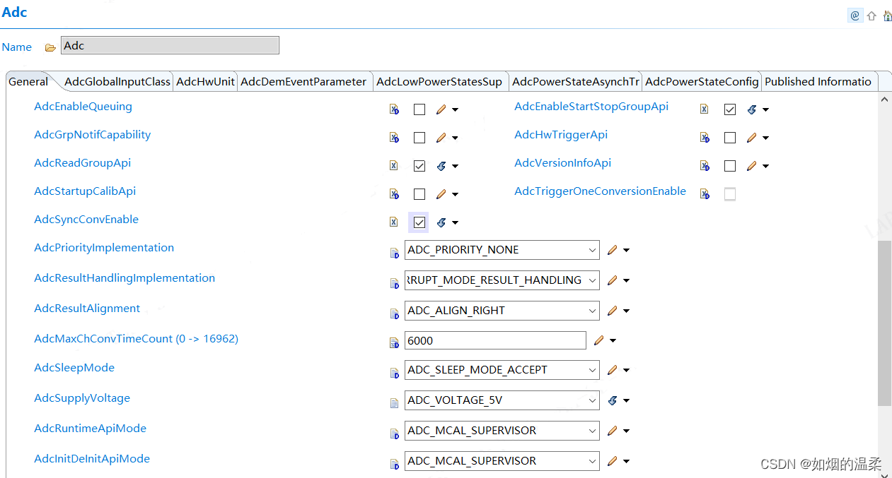

**AdcPriorityImplementation** ：
确定转换请求的优先级机制是否可用，如果可用，则确定优先级机制的类型。此选择适用于具有软件触发源和硬件触发源的组；
有三种优先级机制可以选择分别是：
AdcPriorityHw（硬件优先级机制）:只有硬件优先级机制可用
(AdcPriorityHwSw)：硬件和软件优先级都可用；
 ADC_PRIORITY_NONE ：优先级机制不可用；
软件触发组的组优先级通常配置为低于硬件触发组的组优先级级别；

**AdcResultHandlingImplementation**：确定ADC驱动程序的结果处理模式；
ADC_INTERRUPT_MODE_RESULT_HANDLING:转换结果在请求源ISR (AUTOSAR模式)中传输。
ADC_DMA_MODE_RESULT_HANDLING:使用DMA通道传输转换结果。ADC_POLLING_MODE_RESULT_HANDLING:使用同步api传输转换结果。

**AdcResultAlignment** ：ADC结果缓冲区中的ADC原始结果对齐方式(左/右对齐)。

**AdcMaxChConvTimeCount** (0 -> 16962)
在转换请求停止时，A/D转换器中正在进行的信道转换不能立即停止。相反，软件需要等待信道转换完成。为了确保转换器处于空闲状态，需要对转换器状态轮询进行等待，其最大等待时间由AdcMaxChConvTimeCount中输入的值定义

**AdcSleepMode** ：
该参数决定ADC驱动程序是否接受或拒绝来自SCU的休眠模式请求。
ADC_SLEEP_MODE_ACCEPT: 接受SCU的睡眠模式请求 ；
ADC_SLEEP_MODE_REJECT: 拒绝SCU的睡眠模式请求；

**AdcSupplyVoltage**
该参数将模拟电路调整到所选的电源电压，该参数的默认值为对应SFR的重置值
ADC_VOLTAGE_3P3V: 3.3V固定电源接通；
ADC_VOLTAGE_5V: 固定5V电源接通；
ADC_VOLTAGE_CONTROLLED_BY_SUPPLY: 电压范围由电源控制；

**AdcRuntimeApiMode**
参数定义运行时api将在其中操作的特权模式。
由于ADC驱动程序访问SFRs，在监控器模式下操作ADC驱动程序更加高效。因此，默认的操作模式是supervisor。
当AdcInitDeInitApiMode配置为User-1模式时，AdcRuntimeApiMode必须配置为User-1模式

**AdcInitDeInitApiMode**
配置参数定义初始化和反初始化api将在其中操作的特权模式。
由于ADC驱动程序访问SFRs，在监控器模式下操作ADC驱动程序更加高效。因此，默认的操作模式是supervisor。

###### 3.AdcPublishedInformation


**AdcPublishedInformation**：
关于PublishedInformation(发布信息)

这个模块包含了由BSW模块的实现者定义的数据，当模块适应(即配置)到实际的硬件和软件环境时，这些数据不会改变。它包含版本和制造商信息。这对于为每个BSW提供明确的版本标识是必要的模块。这个模块一般不用配置，保持默认即可，因为主要与硬件相关的部分有关。


## 4、MCAL配置之ADC模块及IO抽象层源码分析

ADC模块是将外部模拟信号转化为芯片内可识别的[数字信号](https://so.csdn.net/so/search?q=数字信号&spm=1001.2101.3001.7020)的中间模块，与MCU的关联为使用了MCU提供的GTM模块中的TOM/ATOM部分的定时效果。

#### 1 ADC界面分析

在ADC界面中，主要配置界面为General, AdcGlobalInputClass和AdcHwUnit三个选项卡。在General选项卡中，通常会使能AdcErrorDetect、AdcReadGroup、AdcEnableStartStopGroup、AdcHwTrigger等选项。第一项将使能ADC的DET检测功能；第二三项将使能软件触发ADC开始、停止组内AD转换和读取组内转换结果的功能；第三项将使能软件控制硬件触发AD转换的接口。

AdcResultHandlingImplementation选择中断模式处理，在第四章中会讲述OS中配置的具体中断。

AdcResultAlignment指定ADC结果的对其方式，一般以右对齐为主，将数据按字节顺序组合起来即得到正确结果。

AdcMaxChConvTimeCount将指定ADC驱动停止转换时需要将转换器状态变化至idle的最大时间，在此软件中默认值为6000ms。


在AdcGlobalInputClass选项卡中，定义了AdcGlobalInputClass的两种类型，包含ADC通道转换模式（指定接收信号的噪声滤波模式）、ADC时钟预分频系数、ADC采样时间长度设置（当前采样时间为2 / f***ADCI\***）和ADC传播早期采样点的使能（用于衰减同步噪声）四个配置项。理论上两种类型可以配置为不同的性质组合，但由于这里的类型不会被HwUnit中使用，故配置为统一默认选项。


在AdcHwUnit选项卡中，需要配置所有ADC硬件group的信息。根据硬件原理图的显示，我们需要配置Group0, Group1, Group2和Group8。


在每一个HwUnit选项卡中，包含了ADC时钟源、预分频系数、通道信息、触发条件等配置选项。在下一节中将结合数据手册和硬件原理图对部分重要选项作详细介绍。


#### 2 ADC关键配置选项

[TOC]

由DataSheet中定义的EVADC管脚复用状态可知AdcHwUnit一共分为0，1，2，3，8，9，10和11几种Group号码，在本项目中仅使用0，1，2和8四个Group号。

##### ②AdcClockSource

指定ADC的时钟源，在Aurix2G中仅能选择系统时钟，与General选项卡中的AdcSystemClock呼应，通过该选项指定系统时钟源。

##### ③AdcChannelId

在每一个Group中需要指定的通道号，该号码需要和硬件原理图上的号码对应起来。

##### ④AdcAnChannelNum

AdcHwUnitId和AdcChannelId共同决定了该参数的配置，格式为GxCHy。

##### ⑤AdcInputClassSelection

指定ADC信号输入类型，可在AdcHwUnitInputClass和AdcGlobalInputClass中选择。此处选择HwUnit中自定义的类型。

##### ⑥AdcGroupAccessMode

当该参数为ADC_ACCESS_MODE_SINGLE时，ADC上层在一次触发后只读取一次结果，当该参数为ADC_ACCESS_MODE_STREAMING时，ADC上层便可在一次触发后可读取多次结果，同时该参数需配合AdcStreamingBufferMode共同使用。本项目中使用ADC_ACCESS_MODE_SINGLE。

##### ⑦AdcGroupConversionMode

该参数代表Adc启动转换的模式，有ONESHOT和CONTINUOUS两种。前者表示转换触发后每个通道仅做一次转换，后者表示转换触发后每个通道可做多次连续的转换。本项目中使用ONESHOT方式。

##### ⑧AdcGroupTriggSrc

有HW和SW两种触发方式，使用HW触发时，只能配合ONESHOT的转换模式，此时若配合定时器则可产生连续采样的效果，一般通过一个二维数组（结果缓存）直接读取硬件触发的转换结果，该二维数组包含了每一个Group中的所有通道结果。使用SW触发时，可配合Adc_StartGroupConversion、Adc_ReadGroup等函数读取转换后的数值。本项目中使用HW触发。

##### ⑨AdcStreamingBufferMode

该参数配合AdcGroupAccessMode为ADC_ACCESS_MODE_STREAMING时使用，软件中会在每个通道中开辟一段空间作为采样空间。当参数为LINEAR时，ADC转换数量等于采样数，当采样数用完后自动停止；当参数为CIRCULAR时，ADC转换不会主动停止，当采样数用完后会从头进行采样并放置，直到调用停止函数。

##### ⑩AdcHwExtTrigSelect

此选项配合AdcGroupTriggSrc为HW方式时使用，指定硬件触发源。

##### ⑪AdcHwTrigSignal

此选项配合AdcGroupTriggSrc为HW方式时使用，指定在哪个信号跳变沿会进行硬件触发。次处选择ADC_HW_TRIG_RISING_EDGE。

##### ⑫GtmTimerUsed

指定使用[MCU](https://so.csdn.net/so/search?q=MCU&spm=1001.2101.3001.7020)模块中的哪一个定时器，此处我们使用TOM，在MCU中需要将对应通道配置为ADC的使用方式。

#### 3 MCU关键配置选项

在MCU中需要配置用于ADC转换的[GTM](https://so.csdn.net/so/search?q=GTM&spm=1001.2101.3001.7020)时钟，同时，在配置前需要清楚哪些通道可以用来作为该转换使用。


##### ①McuGtmTomChannelAllocationConf

指定该TOM通道被分配用于ADC转换的时间触发源，故选择GTM_TOM_CHANNEL_USED_BY_ADC。

##### ②McuTomChannelEventHandledByDsadc

指定TOM通道的触发事件将是否被DSADC模块处理，我们使用的转换模块为EVADC，故此项选择为FALSE。

#### 4 OS关键配置选项

根据第一章中对AdcHwUnit部分的分析，四个Group各自需要一个中断关联至硬件触发源，故需要在OS中配置四个ADC中断：ADC0SR0, ADC1SR0, ADC2SR0, ADC8SR0。下图展示的是其中之一的配置，注意需将Address/Vector的选项和ISR的名字保持一致，四个ISR都属于二类中断，优先级保持连续即可。


#### 5 与IoHwAb层相关的源码分析

ADC部分的IO抽象层源码会通过枚举体定义每个HwUnit和通道信号的名称，在Buffer读取函数中可方便管理。同时，我们需要定义一个GroupType和Channel相关信息的结构体，前者用于设定每个Group的状态，后者用于对接收值做转换管理。最后，定义一个用于管理每个Group中信号值的数组。定义部分源码如下所示：

```cpp
typedef enum
{
    ADC_VBAT_12V,
    ADC_IG_12V,
    ......
    ADC_PROJ_ID,
    ADC_PCB_TEMP,
    IoHwAb_ADC_Signal_MAX
}IoHwAb_ADC_Signal;

typedef enum
{
    ADC_HWUNIT_0,
    ADC_HWUNIT_1,
    ADC_HWUNIT_2,
    ADC_HWUNIT_8,
    IoHwAb_ADC_HwUnit_MAX
} IoHwAb_ADC_HwUnit;

typedef struct
{
    Adc_GroupType group;
} IoHwAb_ADC_Group_Config;

typedef struct
{
    IoHwAb_ADC_HwUnit hwunit;
    uint8 channel;
    Adc_GroupType  immediateGroup;
    float32 coff;

} IoHwAb_ADC_Channel_Config;

static Adc_ValueGroupType IoHwAb_ADC_Buffer[IoHwAb_ADC_HwUnit_MAX][IOHWAB_ADC_CHANNELS_PER_HWUNIT];
```

在初始化函数中，会对每一个HwUnit进行结果缓存的初始化，最后打开硬件触发源。之后，IoHwAb_ADC_Buffer数组会被自动更新。

```cpp
void IoHwAb_ADC_Init(void)
{
    uint8 grp_idx;
    Adc_GroupType adc_group;
    Adc_ValueGroupType* adc_valueGroup;
    for (grp_idx = 0; grp_idx < IoHwAb_ADC_HwUnit_MAX; grp_idx++)
    {
        adc_group = IoHwAb_ADC_Group_Cfg[grp_idx].group;
        adc_valueGroup = &IoHwAb_ADC_Buffer[grp_idx][0];
        /* Initialise the Result buffer for group */
        ret_t[grp_idx] = Adc_SetupResultBuffer(adc_group, adc_valueGroup);
        /* Start the group */
        Adc_EnableHardwareTrigger(adc_group);
    }
}
```

在缓存读取函数中，会将读取的数字量转换为模拟量。值得注意的是，AD转换的二进制位总共有12bit，故分辨率为1/4095。在硬件部分使用的电压阈值上限为5V，故最终乘以5得到模拟电压。

```cpp
float32 IoHwAb_ADC_GetBufferedValue(IoHwAb_ADC_Signal in_ad)
{    
    IoHwAb_ADC_HwUnit ad_hwunit; 
    uint8 ad_channel;
    uint16 ad_value_raw;
    float32 ad_value;    
    float32 ad_coff;
    ad_hwunit = IoHwAb_ADC_Channel_Cfg[in_ad].hwunit;
    ad_channel = IoHwAb_ADC_Channel_Cfg[in_ad].channel;
    ad_coff = IoHwAb_ADC_Channel_Cfg[in_ad].coff * 4095 / 5;
    ad_value_raw = IoHwAb_ADC_Buffer[ad_hwunit][ad_channel];
    ad_value = (float32)ad_value_raw / (float32)ad_coff;
    return ad_value;
}
```

## 5、AURIX的ADC采样

我们来说说[AURIX](https://community.infineon.com/t5/AURIX-Development-Studio/bd-p/cnads)的ADC采样，ADC采样的原理我们就不过多介绍了，我们主要说明AURIX的ADC请求源处理以及结果处理。

**1、扫描方式与请求源类型**

ADC请求源4个，0、1、2、3，如下图所示：


 图1；ADC请求源

这些请求源可以分配给不同ADC采样方式，作为特定采样方式的请求源。采样方式可以分为三种：队列扫描采样、自动扫描采样、后台自动扫描采样。

（1）**队列扫描采样**：这种方式，ADC采样通道可以分配为特定的队列（对多8个通道）逐次进行采样，采样顺序与通道号无关可以自行定义。这种方式可以用的请求源为请求源0和请求源3，分别可以定义8个通道的队列。

（2）**自动扫描采样**：这种方式是指某个group的多个通道可以依次进行ADC采样，顺序必须按照通道号来进行。一个group的所有通道都可以加入扫描。这种方式可以使用请求源1。

（3）**后台自动扫描采样**：这种方式可以让所有group都加入到扫描，其扫描方式与自动扫描采样相同，可以使用请求源2。

所有的这些请求源可以同时被使能，那么当前有效的请求源就需要ADC仲裁来确定。而仲裁是通过当前请求源的优先级来决定的。每种请求源都会被定义为对应的仲裁时间节点（slot），那么就会有4个slot。而请求源的优先级也就会有4个，由GxARBPR. PRIx来定义。


图2：仲裁时间节点

仲裁结果处理发生在当前请求源和新的请求源切换时，其处理方式有三种：

（1）cancel-inject-repeat mode直接中断当前转换，高优先级抢占低优先级 ；

（2）wait-for-startmode等待当前AD转换完成后立即转换 ；

（3）wait-for-read mode如果结果寄存器没被读，则延迟等待读完后再AD转换。

 

**2、请求源的产生**

每个请求源的产生方式都有两种：内部产生、外部触发。我们以队列扫描采样为例：


 

图3：队列扫描结构图

如图3所示：对外部触发产生请求进行了详细的描述。包括两个外部信号：门控和触发，两个信号共同产生外部触发。门控是电平控制、触发是边沿控制，另外门控信号又可以同时作为触发信号。我们在TOM触发ADC采样的帖子中详细介绍了这部分的内容，大家可以参考。

内部软件产生请求是通过GxQMR0.TREV = 1来产生。

 

**3、结果处理**

ADC单元提供16个结果寄存器，可以用来存放处理结果。转换结果的有效位取决于转换精度，VADC单元支持的转换精度有8位、10位、12位，分别对应256、1024、4096个值。

结果存储可以按照下图的方式进行：


 

图4：结果存储方式

 

**4、中断配置**

ADC常用3种中断，可分别由3中事件产生：

（1）请求源事件：当前请求源触发产生的转换事件全部完成；

（2）通道事件：当次转换完成；

（3）结果事件：结果寄存器产生了一个新的有效的结果值。

这些事件产生的中断可以请求CPU或者DMA来进行处理，其中DMA处理在前面介绍过，就是将ADC采样结果寄存器的值传输到特定地址单元。

以上内容便是对ADC单元的调试总结，很多细节内容需要大家**结合手册**来看。


# [使用EB配置ETH驱动](https://www.cnblogs.com/lance9527/p/17467237.html)

eht的配置只涉及eth mcu port 这3个模块，实际的工作会使用irq和dma，但这两个模块已经集成到MCAL的驱动代码中了，用户无需配置，只需要注意自己在使用dma和irq时不要和eth代码中使用的重复即可，具体eth驱动中irq和dma的使用情况，用户撸代码吧。

mcu配置如下：


 

涉及到的15路pin的配置如下：


 

 对于不需要上下电阻配置，pcb上直连的硬件方案，可以使用下图配置


 

美威系列的phy88E1512 硬件内部集成了延时，因此不需要pcb等长布线和 软件mac中的延时配置； 而RTL系列的phy则需要


MDI接口始终是一个媒体接口。RGMII/MII接口始终是一个系统接口。SGMII接口既可以是系统接口，也可以是媒体接口。系统接口是mac和phy之间的接口，媒体接口是phy和RJ45端子间的接口。

 eth的配置如下：


 

关于MDC和MDIO的补充：phy芯片的地址一般是0或者1(<<24)， phy会有自己独立的MAC地址

 

 

网络进阶：

参考： https://blog.csdn.net/zyqash/article/details/128844230    https://blog.csdn.net/qq_40309341/article/details/119026295


 

网络数据的传输就是这样从上到下一层一层的往上裹数据，上一层的全部数据只是下一层的payload，最终在物理层上形成如下2中帧格式


前导码和结尾的FCS会由物理层自动添加和剔除，用户不需要手动添加，因此wireshark软件是看不到前导码和FCS域的，因为上位机软件是从数据链路层提取数据的，已经由物理层硬件自动剔除前导码和FCS域了；

从目的地址的第一个字节到数据部分的最后一字节，一共 6 + 6 + 2 + 46~1500 参与多项式为0x04C11DB7的crc32，计算结果即FCS域的值；

数据域数据的长度必须是[46, 1500]，不够了会补0，超过了会拆包；

 从第一个FF到最后一个00，一共6+6+2+46参与多项式为0x04C11DB7的crc32，最后4B为校验值0x88F02B60； 这是MCU端剔除前导码后余下的完成报文。

 tcpdump 抓包命令 sudo tcpdump -i eth4  -w test.cap


# MCAL：英飞凌OVC（OverLay）地址重定向

## 1、概述

​    为了[标定](https://so.csdn.net/so/search?q=标定&spm=1001.2101.3001.7020)，很多控制器提供了overlay的功能，将flash数据加载到RAM区域，这个过程被称为flash仿真或flash重定向。用来XCP的页切换功能。

​    假设遇到多个FLASH区域，对应一个RAM区域，就可以通过将单次单个FLASH区域的数据放置到RAM里面，实现页切换与数据映射功能。

​    因为这是特定于目标的，所以用户需要参考目标微控制器的参考手册来实现(本文锚点是TC275单片机为例)该功能。然而，该函数应具有以下功能:

·指定[overlay](https://so.csdn.net/so/search?q=overlay&spm=1001.2101.3001.7020)闪存和RAM内存的地址和大小

·将overlay闪存中的数据复制到目标RAM中

·为overlay初始化全局寄存器

·这个功能需要放在[XCP](https://so.csdn.net/so/search?q=XCP&spm=1001.2101.3001.7020)的初始阶段。

Overlay对页切换的作用

该特性由Overlay的全局寄存器控制。该函数应具有以下功能:

当主机请求进入工作页时，通过Xcp_SetCalPage命令切换到对应页码的工作页RAM区域。

当主机请求进入参考页时，通过Xcp_SetCalPage命令切换到对应页码的参考页Flash区域。


 展示代码如下


## 2、OverLay数据手册概述

### 2.1、手册概述

​    数据overlay功能提供了将选定的数据访问重定向到overlay内存的能力。TriCore对程序闪存、在线数据采集空间或EBU空间的数据访问可以重定向。overlay存储器可以位于本地存储器(如果存在)、仿真存储器(仅限仿真设备)或DPSR/PSPR存储器中。覆盖功能使其成为可能，例如，在程序运行期间修改应用程序的测试和校准参数(通常存储在闪存中)。注意，只有读和写数据访问被重定向。访问重定向的执行没有性能损失。

​    注意:由于地址转换是在DMI中实现的，它只对TriCore的数据访问有效。由TriCore获取指令或访问任何其他主控(包括调试接口)不受影响!

**功能总结**

1、重定向数据访问地址到PFLASH，OLDA或外部EBU空间。

2、支持重定向到覆盖内存位于:

-本地内存(LMU)(如果存在)

-仿真内存(仅限仿真设备)

-DSPR或PSPR内存

3、支持多达4 MB的覆盖内存地址范围

4、在每个TriCore实例中可以使用最多32个覆盖范围(“块”)。

5、overlay块大小从32字节到128 k字节

6、多达4 MB的重定向空间(32个区间x 128 k字节)

7、对每个overlay块单独选择overlay内存位置和块大小;

8、可以通过一个寄存器写入访问启用或禁用多个overlay块;

  SCU_OVCCON.U = 0x00050007;/*Overlay Start, OVSTRT = 1, OVSTP = 0*/

所属寄存器章节位置


 注意一个名词DMI: 5.11 章节 Data Memory Interface (DMI)

9、在DMI中控制数据缓存的可编程刷新(无效)控制

10、overlay开始/停止同步数据负载

11、每个核都有独立的overlay系统

### 2.2、数据重定向

​    从原始目标存储器(“目标地址PFLASH”)重定向数据访问到overlay存储器(“重定向地址RAM”)的原理如下所示。

​    简而言之就是将已有的PF目标地址重定向到其他位置（重定向地址RAM）提供XCPO的工作页。

​    

 从上图可以看出，overlay Memory定义的时是RAM区域。

数据访问overlay是通过overlay范围定义的，每个overlay块定义了一个连续的地址空间范围，访问被重定向。每个overlay块配置如下参数:

1、overlay块目标基地址-目标地址范围的开始地址（PF）;

2、overlay块大小-地址的大小将被重定向

3、overlay块重定向地址-重新定向的开始地址(RAM)。

在TC27x中,可以在每个TriCore实例中使用最多32个覆盖范围

每个覆盖块有3个相关寄存器用于独立配置这些参数。覆盖参数配置如下:

·目标基本地址配置为OTARx寄存器：一般是PFLASH


 ·overlay块大小配置了OMASKx寄存器：对应位是1的地方让定向的地址与基地址作比较，要是要定向的地址与基地址一样可以重定向，不一样不可以重定向，下文有描述


 ·重定向地址配置为RABRx寄存器：一般是RAM


​     覆盖内存块的大小可以是2n x 32字节（这里是2的n次方，下文有解释来源），n = 0到12。这给出了块大小从32字节到128 kb的范围。块的起始地址只能是已编程块大小的整数倍(自然对齐边界)。如果OTAR寄存器值或RABR寄存器值与块大小不一致，则忽略最低有效位值并将其视为零。

   重定向地址由RABRx寄存器的两个字段决定:

1、RABRx.OMEM 选择overlay内存

2、RABRx.OBASE选择基地址内存

​    通过RABRx.OVEN位每个overlay块可以单独激活或者去激，也可以组合形式的实现。

地址重定向过程如下图所示。


​     对段8H或段AH的任何数据访问都要对照所有激活的overlay blocks进行检查。对于每个激活的overlay blocks ,地址位27...5与目标base地址(OTARx)进行比较,这种位比较由OMASKx寄存器的内容限定（限定的是块大小）。如果相应的OMASKx位设置为1 ,则地址位参与比较。如果当前访问的地址中OMASKx为1的位的值等于OTARx寄存器中的相应位,则访问被重定向。（下面先简单解释一下，后面例子里面会详细解释）。  

​    段8H或段AH ：指PF内存的高位，例如PF 0x8000 0000 （携带Cache）与0xA000 0000 （不携带Cache）。此处有没有Cache选择关联着OVCCON.DCINVAL

​    地址位27...5与目标base地址(OTARx)进行比较：理解上其实就是将基地址的数据27...5填入Tbase位域，举例如下


 再举个其他地方看到的例子：

​    我们设定的flash base地址为0x80180000,size为32Kbyetes,对应的mask位5-16位的值110000000000 ,当访问的内存地址为0x80180004,此时为1的位都相等(15,16位都为0，与基地址的是相等的)，会进行重定向，当访问的内存地址为0x80189000时，mask为1的位不相等(当前访问的15位为1，设定的为0),不会进行重定向，从这个例子可以看出，想重定向，需要再OMASK为1的位置，需要重定向的地址与设定的地址bit位一致，其实也就是范围上的限制。


**重定向地址如下:** 

1、地址位31…22bit的设置根据overlay内存选择（RABRx.OMEM）与原始地址的缓存能力，也就是Cache。

2、对于地址位21…5

·如果设置了相应的OMASKx位，则地址位的值取自RABRx.OBASE位域;

·如果清除对应的OMASKx位，则地址位的值取自原地址。

·地址位4..0总是直接取自原始地址。

| 31…22                                                        | 21…5                | 4…0              |
| ------------------------------------------------------------ | ------------------- | ---------------- |
| 举例：RABRx.OMEM = 8为LMU段地址开始B/9000 0000H假设为B000 0000前面的10个bit拆解1011 0000 00 B  0 | RABRx.OBASE位域的值 | 直接取原地址的值 |
| 决定地址的寄存器主要是：OMASKRABR                            |                     |                  |

举个其他地方看到的例子

​    目标地址0x80180000和size为32Kbyetes,我们设置重定向base地址为0x60008000(为core1的ram,需要设置RABRx.OMEM为1，也就是Core1 DSPR/PSPR,对应的RAM位0x6000 0000开头的地方)，设置RABRx.OBASE为0x400，若访问的内存为0x80180004,则重定向地址最高位为6 ( core1 DSPR/PSPR ) ，重定向地址为0x60080004。


### 2.3、目标内存

​     对段8H或段AH内任何内存的数据访问可以重定向到overlay内存。特别是，对以下内存的访问可能会被重新定向:

• Program Flash;
• Data Flash;
• OLDA space;
• External EBU space

**在线数据采集**

虚拟OLDA内存范围还支持校准。虚拟OLDA内存范围的基址为A/8FE7 0000H。

### 2.4、OverLay内存

​    在下面,描述了所有支持的Overlay内存。注意,依赖于设备类型的仅是列出的覆盖内存的子集。

Overlay内存通过寄存器RABRx.OMEM位域进行独立选择的。

***\*Local Memory\****

​    如果存在，可以选择本地内存(LMU)进行Overlay。Overlay块x重定向选择本地内存，如果是RABRx.OMEM值为6。LMU的基址为B/9000 0000H。在地址转换过程中，前10位地址位被设置为B0H00B(目标段A)或90H00B(目标段8H)。

***\*Emulation Memory\****

​    如果存在，可以选择仿真内存(EMEM)进行Overlay。Overlayx重定向选择仿真内存，如果是RABRx.OMEM值为7。仿真内存的基址为B/9F00 0000。在地址转换过程中，前10位地址位被设置为BFH00B(目标段Au)或9FH00B(目标段8H)。

***\*DSPR & PSPR Memory\****

​    核0、1、2的数据暂存缓存器（DSPR）与程序暂存缓存器（PSPR）可以被选择为Overlay，DSPR或PSPR为叠加块x重定向选择,假设RABRx.OMEM值为0，1，2。基地址是 7000 0000H,6000 0000H, or 5000 0000H. 在地址传输期间,高10位地址设置为70H00B,60H00B,或50H00B。基于RABRx.OBASE位的值DSPR（偏移地址是0）PSPR（偏移地址10 0000H）可以供选择。

### 2.5、全局OverLay控制

​    Overlay可以为每个Core单独禁用或启用,使用OVCENABLE寄存器实现。如果OVCENABLE.OVENx位被清除后,无论剩下的寄存器设置如何，Core x上都不允许地址重定向。写入OVCENABLE寄存器不会改变任何剩余的寄存器值。

​    每个OverLay块都可以通过位RABRx.OVEN单独激活与停用，有一个专用的功能，可以激活与停用多个块。这有助于在多个内存区域维护数据一致性，为了实现并发激活和停用OverLay块, 分两个阶段选择OverLay块

1、使用OVCx_OSEL寄存器分别为每个Core x选择激活和去激活的单独块;

2、通过寄存器的OVCCON.CSEL位选择核。

​    可以通过寄存器位OVCCON.OVSTRT来控制多个块的激活与停用。当OVCCON.OVSTRT设置为1时。 表示处于激活状态。

·当OVCCON.CSELx = 1、OVCx_OSEL.SHOVENy = 1  OverLay块Y在Core x里面被激活，此时应该设置OVCx_RABRy.OVEN = 1。

·当OVCCON.CSELx = 1、OVCx_OSEL.SHOVENy = 0  OverLay块Y在Core x里面被停用，此时应该设置OVCx_RABRy.OVEN = 0。

·当OVCCON.CSELx = 0，OverLay在Core x里面的设置是无效的。

​    上面列出的操作是并发（同时）执行的。否则不会改变覆盖配置。有了这个功能，可以直接从一组覆盖块切换到另一组覆盖块。

多个OverLay块可以被同时停用，通过设置寄存器位OVCCON.OVSTP。当OVCCON.OVSTP = 1时。

·当OVCCON.CSELx = 1，所有的OverLay块在Core x都会被停用，所有的OVCx_RABRy.OVEN将会被清除。

·当OVCCON.CSELx = 0，OverLay在Core x里面的设置是无效的。

上面列出的操作是并发执行的。否则不会改变覆盖配置。

注意！注意！注意！

​    **假设通过寄存器RABRx.OVEN控制单个块，就不应该使用全局寄存器OVCENABLE，OVSTRT与OVSTP是处理并发情况的。**

​    当寄存器OVCCON.DCINVAL = 1，也就是使能Dcache时，所有在Cache里面未修改的数据均是无效的。已修改的数据不受影响。没有设置OVCCON.CSEL位的核是不受影响的（核都没选择，那肯定不起作用）。数据缓存失效可以与OVSTP或OVSTP操作相结合。此函数有助于确保CPU在激活或停用覆盖块后访问新数据。

注意！注意！注意！

​    **CSEL, OVSTRT, OVSTP and DCINVAL在同一个寄存器里面，\**不保留写入值，意味着读取的时候始终是0\****


​    OVCCON.OVCONF位是预留的用户控制位，与OVCCON.POVCONF一样，不影响OverLay的功能。

​    当OVCCON寄存器的CSEL与OVSTRT或OVSTP被设置了，与此同时OVCx_RABRy寄存器被写入，OVCx_RABRy.OVEN的值将不会被定义，应该避免这种情况同时发生。

​    在Core的IDLE状态OVSTRT、OVSTP、DCINVAL将不会被执行。

**全局OverLay同步设置**

​    当请求OVSTRT, OVSTP或DCINVAL动作时，其执行可能会延迟，以防止在正在进行的数据负载期间更改OverLay配置。

​    在请求一个动作之后，在请求另一个动作之前，应该有足够的时间。如果一个新的操作被请求，而之前的操作仍然挂起(由于与CPU负载同步)，一些操作可能会丢失。

### 2.6、OverLay配置的更改

​    在操作OTARx,OMASKx或RABRx寄存器之前应该通过清除它的RABRx.OVEN位，禁用OverLay块。否则，可能会发生意外的访问重定向。只有在目标地址、覆盖内存选择、重定向地址和掩码都配置了预期值的情况下，才应该启用覆盖块。

注意！注意！注意！

​    OverLay控制不能防止错误地配置转换逻辑。特别是，不阻止重定向到未实现或禁止的地址范围。

​    如果需要数据一致性，则需要特别注意将OverLay重定向更改同步到执行的指令流。

​    外部访问可以在CPU中进行缓冲。尚未完成的外部访问仍可能受到OverLay配置更改的影响。因此，建议在任何OverLay范围被激活或去激活之前，确保完成所有挂起的访问(例如，通过执行DSYNC指令)。

​    当启用OverLay块并且通过目标地址空间写入相同的内存位置并通过重定向地址空间读取相同的内存位置时，反之亦然，则需要强制执行访问同步(如果适用，则使用DSYNC和数据缓存回写)。

### 2.7、访问保护、属性、并发匹配

当使用Overlay重定向数据访问时，使用的访问保护如下:

·目标地址受CPU内存保护(MPU)验证;

·重定向地址受安全保护验证。（是OVCCON的保护寄存器？）

重定向访问的物理内存属性是根据目标地址段(参见CPU物理内存属性章节)。

​    不支持多个已启用的Overlay块中的并发匹配。当一个地址与两个或多个已启用的Overlay块匹配时，将引发异常并且不执行内存访问。在Overlay范围上具有多个匹配的负载操作会引发数据访问同步错误(DSE)陷阱，而存储操作会引发数据访问异步错误(DAE)陷阱。在这种情况下，相关的trap信息寄存器:数据同步trap寄存器(DSTR)，数据异步trap寄存器(DATR)和数据错误地址寄存器(DEADD)被更新。

### 2.8、Overlay控制寄存器

​    OVC块控制寄存器位于支持数据访问Overlay的每个模块中。OVC全局控制寄存器位于SCU中。OVC寄存器访问可以通过安全寄存器保护来限制。


寄存器的基地址如下


 偏移量如下


符号P:带安全保护的写访问

符号SV:管理员模式下允许访问

符号U:允许在用户模式0或1下访问

符号32:只允许32位字访问

### 2.9、模块控制寄存器

​    对于32个Overlay内存块中的每一个(由索引x表示)，三个寄存器控制Overlay操作和内存选择:

·RABRx,设置Overlay内存，包含了激活位，此处假设是常规使用英飞凌单片机位RAM区域地址设置。

·OTARx，Overlay目标地址寄存器，显示OverLay内存的基地址

·OMASKx，它决定哪些位（来源于RABRx）作为基地址（对Overlay的内存以及块）与哪个位(原始数据地址)直接被用作块中的偏移量。

​    此外，OverLay范围选择寄存器OSEL决定在OVCCON时启用哪些块，禁用哪些块。设置了OVSTRT位。

​    随着应用程序复位，所有OverLay块控制寄存器被重置为其默认值。不考虑特殊的调试重置。    

 ***\*CSELx\*******\*位存在疑问，此处是为了以此控制多个\*******\*OverLay\*******\*而存在还是因为其他的呢？\****

 

## 3、OverLay代码解析

下面例子与测试使用的非一套代码，但是都是有效代码，注意识别

### 3.1、初始化

```c
void Xcp_OverlayMem_Init(void)
{
	/* The calibration size is 24KB,
	 * Flash CAL: 0xAF05_8000H - 0xAF05_DFFFH, 24KB (16KB, 0xAF05_8000 - 0xAF05BFFF; 8KB, 0xAF05C000 - 0xAF05DFFF)
	 * Ram CAL  : 0x7000_0000H - 0x7000_5FFFH, 24KB (16KB, 0x7000_0000 - 0x70003FFF; 8KB, 0x70004000 - 0x70005FFF)
	 */
	/* The calibration size is 24KB, but supported overlay block are 8,16,32,64KB...
	 * Here 2 overlay blocks are configured
	 * Block 0: size 16KB
	 * Block 1: size 8KB
	 */
	Mcal_ResetCpuENDINIT(-1);
	Mcal_ResetCpuENDINIT(0);
	SCU_OVCENABLE.B.OVEN0 = 1;
    /*假设此处需要处理其他两个核，
    * 开启其他核即可，另外下面的地址与OMASK配置也是开启其他核就行
    *SCU_OVCENABLE.B.OVEN1 = 1;
    *SCU_OVCENABLE.B.OVEN2 = 1;
    */
	Mcal_SetCpuENDINIT(0);
	Mcal_SetCpuENDINIT(-1);
	/* ----------------------------Start Configuration for Block 0 -----------------------------------*/
	OVC0_OSEL.B.SHOVEN0 	= 1; /* Enable overlay on Block 0 */
	OVC0_OMASK0.B.OMASK 	=  0xE00; /* 1110 0000 0000B, 16K block size */
	/* Base Address
	 * 								  |<-- OMASK--->|
	 * 0xAF05_8000= 1010|1111|0000|0101|1000|0000|0000|0000
	 * OMASK      = 0000|1111|1111|1111|1100|0000|0000|0000 (0xE00)
	 * TBASE      = ****|1111|0000|0101|1000|0000|000*|****
	 * 			  = 	  111 1000 0010 1100 0000 0000 = 0x782C00
	 */
	OVC0_BLK0_OTAR.B.TBASE 	= 0x782C00;
	/* Redirection to Core 0 DSPR/PSPR memory for Block 0 - 4kB */
	OVC0_BLK0_RABR.B.OMEM 	= 0x0;  /* 0, Core 0 DSPR; 1, Core 1 DSPR; 6 - Redirect to LMU memory; 7 - Redirection to EMEM; 3..5H Reserved, do not use */
	/* Overlay Address
	 * 								  |<-- OMASK--->|
	 * 0x70000000 = 0111|0000|0000|0000|0000|0000|0000|0000
	 * OMASK      = 0000|1111|1111|1111|1100|0000|0000|0000 (0xE00)
	 * OBASE      = ****|****|**00|0000|0000|0000|000*|****
	 * 			  =		        00 0000 0000 0000 000 =0x00
	 */
	OVC0_BLK0_RABR.B.OBASE 	= 0x00; 
	/* ---------------------------- End Configuration for Block 0 -------------------------------------*/
	/* ---------------------------- Start Configuration for Block 1 -----------------------------------*/
	OVC0_OSEL.B.SHOVEN1 	= 1; /* Enable overlay on Block 1 */
	OVC0_OMASK1.B.OMASK 	=  0xF00; /* 111100000000B, 8K block size */
	/* Base Address

	 * 								  |<-- OMASK---->|
	 * BaseAddr   = 1010|1111|0000|0101|1100|0000|0000|0000 (0xAF05C000)
	 * OMASK      = 0000|1111|1111|1111|1110|0000|0000|0000 (0xF00)
	 * TBASE      = ****|1111 0000 0101 1100 0000 000*|****
	 * 			  = 	  111 1000 0010 1110 0000 0000 = 0x782E00
	 */
	OVC0_BLK1_OTAR.B.TBASE 	= 0x782E00;
	/* Redirection to Core 0 DSPR/PSPR memory for Block 1 - 8kB */
	OVC0_BLK1_RABR.B.OMEM 	= 0x0;  /* 0, Core 0 DSPR; 1, Core 1 DSPR; 6 - Redirect to LMU memory; 7 - Redirection to EMEM; 3..5H Reserved, do not use */
	/* Overlay Address
	 * 								  |<-- OMASK---->|
	 * OverAddr   = 0111|0000|0000|0000|0100|0000|0000|0000	(0x70004000)
	 * OMASK      = 0000|1111|1111|1111|1110|0000|0000|0000 (0xF00)
	 * OBASE      = ****|****|**00 0000 0100 0000 000*|****
	 * 			  =		        00 0000 0100 0000 000 =0x200
	 */
	OVC0_BLK1_RABR.B.OBASE 	= 0x200;
	/* ---------------------------- End Configuration for Block 1 -------------------------------------*/
	SCU_OVCCON.B.CSEL0 = 1; /* Select CPU0 */
	SCU_OVCCON.B.DCINVAL = 1; /* only use non-cached access */
	SCU_OVCCON.U |= 0x03000000;
}
```


###  3.2、使能与关闭

```c
void Xcp_OverlayMem_SetEnabled(boolean enabled)
{
	if(enabled)
	{

		/* XcpApp_CurrentCalPage is WORKING_CAL_PAGE; */
		SCU_OVCCON.U = 0x00050001;//Overlay Start, OVSTRT = 1,Select CPU0,DCINVAL
		OverlayMem_Flag = TRUE;
	}else
	{
		/* XcpApp_CurrentCalPage is REFERENCE_CAL_PAGE; */
		SCU_OVCCON.U = 0x00060001; //Overlay Stop, OVSTP = 1,Select CPU0,DCINVAL
		OverlayMem_Flag = FALSE;
	}
}
```

### 3.3、内存同步

```c
void Xcp_OverlayMem_Sync(void)
{
    Xcp_MemCopy((uint32*)CALRAM_START_ADDR,
                (uint32*)CALFLASH_START_ADDR,
                CAL_MEM_SIZE);
}
```

Xcp_MemCopy（）是XCP生成的源码部分

所处位置


 

## 4、测试结果

1、正常调用XCP的OVERLAY使用


2、去除同步代码


 未进行同步之前


 同步之后


